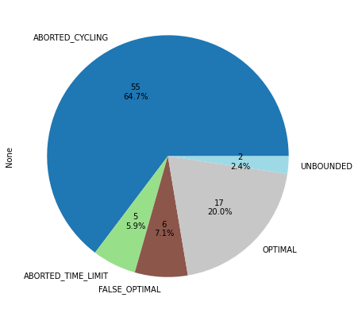

# PPGI-PO-Simplex

Aluno: Victor José de Sousa Koehler

Matrícula: 20211023501


## Introdução

Neste trabalho é apresentado uma simplificada implementação do algoritmo Simplex Revisado (Duas Fases) como requisito da avaliação da disciplina de Pesquisa Operacional do Programa de Pós-Graduação em Informática (PPGI) da Universidade Federal da Paraíba (UFPB). Esta implementação possui teor puramente educativo e não deve ser seriamente utilizada em ambientes de produção. Ao final deste documento são apresentados alguns resultados de experimentos computacionais realizados com esta implementação utilizando um conjunto de instâncias de programas lineares bem conhecido da literatura, bem como uma comparação com o mesmo conjunto utilizando um resolvedor considerado estado-da-arte.

As referências deste trabalho incluem, além das notas das aulas, os seguintes materiais:

> ANTOLÍN CAMARENA, Omar. Math 340: Linear Programming. Disponível em: <https://www.matem.unam.mx/~omar/math340/>. Acesso em: 2 jun. 2022.

> LAVROV, Mikhail. Lecture 14: Duality and the Simplex Tableau. Disponível em: <https://faculty.math.illinois.edu/~mlavrov/docs/482-spring-2020/lecture14.pdf>. Acesso em: 2 jun. 2022.

> MACAMBIRA, Ana Flavia Uzeda dos Santos; MACULAN, Nelson; CABRAL, Lucídio dos Anjos Formiga; et al. Programação linear. [s.l.]: Editora UFPB, 2016.


### Dependências

- Eigen v3.4.0: Disponível em [https://eigen.tuxfamily.org](https://eigen.tuxfamily.org), deve ser extraído para `src/include/Eigen`.

## Estrutura do Código

A pasta `src/` abriga os arquivos com os códigos-fonte. Nela estão contidos, além das implementações, os seguintes *headers*:

- Variable.hpp:  Contém a classe *Variable*, que representa uma variável do problema.
- Expression.hpp:  Contém a classe *Expression*, que modela uma expressão matemática.
- Constraint.hpp:  Contém a classe *Constraint*, que herda de *Expression* e representa uma inequação matemática do problema (restrições).
- Objective.hpp:  Contém a classe *Objective*, que herda de *Expression* e representa a função objetivo do problema.
- Model.hpp:  Contém a classe *Model*, que armazena, encaixa e gerencia as classes descritas acima de forma a modelar completamente um Problema Linear.
- LPParser.hpp:  Contém classes e rotinas que permitem a importação de arquivos de extensão ".lp" para instâncias da classe *Model*.
- Xplex.hpp:  Contém a classe *Xplex*, que recebe um problema descrito em uma instância de *Model* e resolve-o através do método Simplex Revisado (Duas Fases).
- Clock.hpp: Contém estruturas auxiliares para cronometragem.
- global.hpp: Contém estruturas auxiliares frequentemente utilizadas.

Existem três maneiras possíveis de utilizar-se desta implementação de modo a descrever um determinado problema em uma instância da classe *Model*, e em seguida, resolvê-lo através de *Xplex*. A título de exemplo, a seguir são apresentados os métodos e, então, eles são utilizados para descrever o mesmo problema.

A primeira maneira consiste no uso direto e programático dos métodos e membros da classe *Model* (não recomendado):

<details><summary>Método I de modelagem de problemas:</summary>

```C++
//   Utilizando a API das classes Model e relacionadas diretamente através dos membros
void example_5_i() { // Snippet of main.cpp::141
    Xplex::Model m;
    auto x1 = *m.newVariable("x1");
    auto x2 = *m.newVariable("x2");
    auto c1 = Xplex::Constraint("c1", 4);
    auto c2 = Xplex::Constraint("c2", 12);
    auto c3 = Xplex::Constraint("c3", 18);
    c1.setVariableCoefficient(x1, 1);
    c2.setVariableCoefficient(x2, 2);
    c3.setVariableCoefficient(x1, 3);
    c3.setVariableCoefficient(x2, 2);
    m.add(c1);
    m.add(c2);
    m.add(c3);
    // m.objective() defaults to Maximization. To change it, you must multiply by -1
    // const auto Minim = Xplex::ObjectiveFunction::ObjectiveType::Minimization;
    // if (m.objective().getOriginalObjectiveType() == Minim) m.objective().multiplyBy(-1);
    m.objective().setVariableCoefficient(x1, 3);
    m.objective().setVariableCoefficient(x2, 5);

    Xplex::Xplex xplex(&m);
    xplex.solve();
}
```

</details>

A segunda consiste no uso programático de operadores sobrescritos sobre a classe *Expression* e derivados. Método recomendado caso o usuário opte por descrever os problemas de forma programática, isto é, usando a liguagem de programação (C++), devido a sua maior legibilidade e expressividade:

<details><summary>Método II de modelagem de problemas:</summary>

```C++
//   Utilizando a API sobrescrita das classes Expression e derivadas
void example_5_ii() { // Snippet of main_expressions.cpp::4
    Xplex::Model m;
    auto x1 = *m.newVariable("x1");
    auto x2 = *m.newVariable("x2");

    auto c1 =  1*x1        <= 4;
    auto c2 =         2*x2 <= 12;
    auto c3 =  3*x1 + 2*x2 <= 18;

    m.add(c1).add(c2).add(c3);
    m.objective() = Xplex::Maximize(3*x1 + 5*x2);
    m.build();

    Xplex::Xplex xplex(&m);
    xplex.solve();
}
```

</details>

Por fim, este trabalho implementa um interpretador para arquivos no formato ".lp" descrito em https://perso.ensta-paris.fr/~diam/ro/online/cplex/cplex1271/CPLEX/FileFormats/topics/LP.html através da classe `LPParserXplexModel`, e que pode ser invocado através da linha de comando: `./simplex path_to_file.pl`. Este é o método recomendado para leitura e descrição de problemas em arquivos:

<details><summary>Método III de modelagem de problemas:</summary>

```lp
\Utilizando arquivos .lp
\Contrabarra (\) são comentários}
\ENCODING=ISO-8859-1
\Problem name: example5

Maximize
 OBJ: 3.00 x1  +  5.00 x2
Subject To
 c1:   1.00 x1             <= 4
 c2:            +  2.00 x2 <= 12
 c3:   3.00 x1  +  2.00 x2 <= 18
End
```

</details>

## Considerações adicionais sobre implementação, corretude e escopo

Tratando-se de uma implementação puramente educacional, como mencionado anteriormente, alguns *bugs*, causados principalmente por instabilidades numéricas, estão conhecidamente presentes e costumam manifestar-se em problemas relativamente grandes e de longa duração de resolução. Assim sendo, a enumeração *Status* (declarada em *Xplex::Xplex::Status*) contém os seguintes valores que descrevem o retorno da execução do algoritmo e aparecem de forma recorrente nas tabelas contendo os resultados dos experimentos realizados nas próximas seções:

- UNSOLVED: Estado inicial da classe Xplex, quando o método `solve` ainda não foi invocado (ou falhou de forma catastrófica).
- OPTIMAL: Retornado quando o algoritmo encontra a solução "ótima", de acordo com a regra de escolha do coeficiente a entrar na base.
- UNBOUNDED: Retornado quando o algoritmo detecta que a região de soluções do problema é ilimitada.
- ABORTED_TIME_LIMIT: Retornado quando a execução do algoritmo é interrompida por exceder o tempo limite definido pelo usuário.
- ABORTED_CYCLING: Retornado quando uma heurística simples de detecção de ciclos aborta a execução (não necessariamente ciclos degenerados).
- INFEASIBLE: Retornado quando a primeira fase do Simplex falha em encontrar uma solução básica viável para a segunda.

Ressalta-se, novamente, que problemas numéricos podem provocar falsos estados, como ótimos incorretos ou falsos ciclos.

## Resultados

Em seguida são apresentados os resultados de uma série de experimentos realizados sobre o conjunto de instâncias [*netlib*](https://www.netlib.org/lp/). Cada modelo desse conjunto foi baixado, descompactado usando o utilitário *emps* fornecido junto as instâncias, convertido para o formato de arquivo ".lp" pela suíte do resolvedor CPLEX versão 20.1 e, finalmente, a implementação deste trabalho, denominada Xplex, foi executada com um tempo limite predefinido de 30 minutos. Além disso, o resolvedor CPLEX versão 20.1 também foi executado para efeitos de comparação.

Os códigos de interesse foram implementados na linguagem C++, na versão mínima C++17, compilados utilizando GNU GCC versão 9.4.0 (9.4.0-1ubuntu1~20.04.1) e testados em um computador executando o sistema operacional Ubuntu 20.04.1, kernel Linux versão 5.13.0-40-generic#45, equipado com 8GB de RAM e processador AMD Ryzen 7 5700U.


<details><summary>Autogenerated code</summary>

```python
import xml.etree.ElementTree as ET
from os import listdir
from os.path import isfile
import pandas as pd
```

</details>


<details><summary>Autogenerated code</summary>

```python
### Importação dos resultados documentados da literatura
_dfl = pd.read_csv('reference_obj.csv')
_dfl.drop('BR', axis=1, inplace=True)
_dfl['objectiveValue'] = _dfl['objectiveValue'].astype('float')
_dfl.set_index('name', inplace=True)
_dfl = _dfl[_dfl.columns[::-1]]
_dfl.columns = pd.MultiIndex.from_tuples([('Documented Properties', i) for i in _dfl.columns], names=['Algorithm', 'Property'])
# _dfl
```

</details>


<details><summary>Autogenerated code</summary>

```python
### Importa os resultados deste trabalho (Xplex)
_df = pd.read_csv('results.csv', names=['index_', 'name', 'cols', 'rows', 'cycle_cc', 'timelimit', 'Status', 'objectiveValue', 'timeElapsed', 'simplexIterations'])
status_codes = pd.Series(['UNSOLVED', 'OPTIMAL', 'UNBOUNDED', 'ABORTED_TIME_LIMIT', 'ABORTED_CYCLING'])
_df['Status'] = _df['Status'].fillna(0).astype('int').map(status_codes)

# _df['name'] = [i[-1].upper().rsplit('.LP', 1)[0] for i in _df['name'].str.split('/')]
_df['name'] = [i.upper().rsplit('.LP', 1)[0] for i in _df['index_'].str.upper()]
_df.drop(['index_', 'cycle_cc', 'timelimit'], axis=1, inplace=True)
_df.set_index('name', inplace=True)

cols_prop_lvl = ['Detected Properties']*2 + ['Xplex']*4
_df.columns = pd.MultiIndex.from_tuples([(l, i) for l, i in zip(cols_prop_lvl, _df.columns)], names=['Algorithm', 'Property'])
# _df
```

</details>


<details><summary>Autogenerated code</summary>

```python
### Importa os resultados do CPLEX
_cplex_dir_prefix = '../input/sol/'
def read_cplex_sol(_filename : str, dir_prefix=_cplex_dir_prefix):
    # _filename = listdir('../input/sol/')[0]
    with open(dir_prefix+_filename, 'r') as fh: # .parse(dir_prefix+_filename)
        fc = fh.read()
        root = ET.fromstring(fc[:fc.find('<linearConstraints>')] + fc[fc.rfind('<objectiveValues>'):])
        header = next(i for i in root if i.tag == 'header')
        return {
            'name': header.attrib['problemName'].split('/')[-1].upper().rsplit('.LP', 1)[0],
            'Status': header.attrib['solutionStatusString'].upper(),
            'objectiveValue': float(header.attrib['objectiveValue']),
            'timeElapsed': float(fc[fc.rfind('real ')+5:].split('\n')[0].strip()),
            'simplexIterations': int(header.attrib['simplexIterations']),
            'barrierIterations': int(header.attrib.get('barrierIterations', 0))
        }

def read_all_cplex(fn='cplex.csv'):
    if isfile(fn): return pd.read_csv(fn)
    return pd.DataFrame([read_cplex_sol(i, dir_prefix=_cplex_dir_prefix) for i in listdir(_cplex_dir_prefix)])

_cplex_df = read_all_cplex().set_index('name')
_cplex_df.columns = pd.MultiIndex.from_tuples([('CPLEX', i) for i in _cplex_df.columns], names=['Algorithm', 'Property'])
#_cplex_df
```

</details>


### Tabela 1: Resultados completos

A Tabela a seguir relaciona os resultados completos obtidos através da execução dos resolvedores. Cada linha representa uma instância do conjunto de entrada, indexada pelo seu nome. As Colunas "Propriedades (literatura)" relaciona os metadados dos problemas extraídos diretamente do arquivo de descrição do conjunto de instâncias (https://www.netlib.org/lp/data/readme); "Propriedades detectadas" descreve os metadados que o Xplex de fato extraiu das instâncias; as Colunas "Xplex" e "CPLEX" relacionam as estatísticas da resolução dos respectivos resolvedores utilizados.


<details><summary>Autogenerated code</summary>

```python
### Junta os resultados
df = pd.concat([_dfl, _df, _cplex_df], axis=1)
df_naind = df[df.isna().any(axis=1)]
df = df.dropna().sort_index()
# def key_(x):
#     return [i.replace('Input', 'AInput').replace('barrierIterations', 'AbarrierIterations') for i in x]
# df.sort_index(inplace=True, axis=1, key=key_)
# df[df[('Documented Properties', 'cols')] != df[('Detected Properties', 'variables')]]

def translate_dataframe(_df):
    _transl_dict = {
        'Documented Properties': 'Propriedades (literatura)',
        'Detected Properties': 'Propriedades detectadas',
        'objectiveValue': 'Objetivo',
        'cols': 'colunas',
        'rows': 'linhas',
        'timeElapsed': 'tempo (s)',
        'simplexIterations': 'iterações',
        'barrierIterations': 'iterações (Barrier)',
        'nonzeros': 'Não-zeros',
        'Algorithm': 'Algoritmo',
        'Property': 'Propriedade',
        'name': 'Instância'
    }
    _transl_dict_tget = lambda a: _transl_dict.get(a, a) if isinstance(a, str) else (_transl_dict_tget(i) for i in a)
    ndf_ = _df.rename(_transl_dict, axis=1)
    ndf_.columns.set_names(_transl_dict_tget(ndf_.columns.name or ndf_.columns.names), inplace=True)
    ndf_.index.set_names(_transl_dict_tget(ndf_.index.name or ndf_.index.names), inplace=True)
    return ndf_

with pd.option_context('display.max_rows', None, 'display.max_columns', None):
    display(translate_dataframe(df))
```

</details>


<div>
<style scoped>
    .dataframe tbody tr th:only-of-type {
        vertical-align: middle;
    }

    .dataframe tbody tr th {
        vertical-align: top;
    }

    .dataframe thead tr th {
        text-align: left;
    }

    .dataframe thead tr:last-of-type th {
        text-align: right;
    }
</style>
<table border="1" class="dataframe">
  <thead>
    <tr>
      <th>Algoritmo</th>
      <th colspan="5" halign="left">Propriedades (literatura)</th>
      <th colspan="2" halign="left">Propriedades detectadas</th>
      <th colspan="4" halign="left">Xplex</th>
      <th colspan="5" halign="left">CPLEX</th>
    </tr>
    <tr>
      <th>Propriedade</th>
      <th>Objetivo</th>
      <th>bytes</th>
      <th>Não-zeros</th>
      <th>colunas</th>
      <th>linhas</th>
      <th>colunas</th>
      <th>linhas</th>
      <th>Status</th>
      <th>Objetivo</th>
      <th>tempo (s)</th>
      <th>iterações</th>
      <th>Status</th>
      <th>Objetivo</th>
      <th>tempo (s)</th>
      <th>iterações</th>
      <th>iterações (Barrier)</th>
    </tr>
    <tr>
      <th>Instância</th>
      <th></th>
      <th></th>
      <th></th>
      <th></th>
      <th></th>
      <th></th>
      <th></th>
      <th></th>
      <th></th>
      <th></th>
      <th></th>
      <th></th>
      <th></th>
      <th></th>
      <th></th>
      <th></th>
    </tr>
  </thead>
  <tbody>
    <tr>
      <th>25FV47</th>
      <td>5.501846e+03</td>
      <td>70477</td>
      <td>11127.0</td>
      <td>1571.0</td>
      <td>822.0</td>
      <td>1571.0</td>
      <td>820.0</td>
      <td>ABORTED_CYCLING</td>
      <td>1.491440e+04</td>
      <td>89.523600</td>
      <td>2124.0</td>
      <td>OPTIMAL</td>
      <td>5.501846e+03</td>
      <td>0.07</td>
      <td>1920.0</td>
      <td>0.0</td>
    </tr>
    <tr>
      <th>80BAU3B</th>
      <td>9.872322e+05</td>
      <td>298952</td>
      <td>29063.0</td>
      <td>9799.0</td>
      <td>2263.0</td>
      <td>9799.0</td>
      <td>5870.0</td>
      <td>ABORTED_TIME_LIMIT</td>
      <td>-0.000000e+00</td>
      <td>1930.250000</td>
      <td>145.0</td>
      <td>OPTIMAL</td>
      <td>9.872242e+05</td>
      <td>0.12</td>
      <td>2897.0</td>
      <td>0.0</td>
    </tr>
    <tr>
      <th>ADLITTLE</th>
      <td>2.254950e+05</td>
      <td>3690</td>
      <td>465.0</td>
      <td>97.0</td>
      <td>57.0</td>
      <td>97.0</td>
      <td>56.0</td>
      <td>OPTIMAL</td>
      <td>1.768040e+05</td>
      <td>0.031359</td>
      <td>529.0</td>
      <td>OPTIMAL</td>
      <td>2.254950e+05</td>
      <td>0.00</td>
      <td>86.0</td>
      <td>0.0</td>
    </tr>
    <tr>
      <th>AFIRO</th>
      <td>-4.647531e+02</td>
      <td>794</td>
      <td>88.0</td>
      <td>32.0</td>
      <td>28.0</td>
      <td>32.0</td>
      <td>27.0</td>
      <td>OPTIMAL</td>
      <td>-4.647530e+02</td>
      <td>0.005618</td>
      <td>39.0</td>
      <td>OPTIMAL</td>
      <td>-4.647531e+02</td>
      <td>0.02</td>
      <td>5.0</td>
      <td>0.0</td>
    </tr>
    <tr>
      <th>AGG</th>
      <td>-3.599177e+07</td>
      <td>21865</td>
      <td>2541.0</td>
      <td>163.0</td>
      <td>489.0</td>
      <td>163.0</td>
      <td>488.0</td>
      <td>ABORTED_CYCLING</td>
      <td>-5.643130e+07</td>
      <td>13.732200</td>
      <td>1319.0</td>
      <td>OPTIMAL</td>
      <td>-3.599177e+07</td>
      <td>0.01</td>
      <td>93.0</td>
      <td>0.0</td>
    </tr>
    <tr>
      <th>AGG2</th>
      <td>-2.023925e+07</td>
      <td>32552</td>
      <td>4515.0</td>
      <td>302.0</td>
      <td>517.0</td>
      <td>302.0</td>
      <td>516.0</td>
      <td>OPTIMAL</td>
      <td>-2.023930e+07</td>
      <td>4.261600</td>
      <td>317.0</td>
      <td>OPTIMAL</td>
      <td>-2.023925e+07</td>
      <td>0.00</td>
      <td>113.0</td>
      <td>0.0</td>
    </tr>
    <tr>
      <th>AGG3</th>
      <td>1.031212e+07</td>
      <td>32570</td>
      <td>4531.0</td>
      <td>302.0</td>
      <td>517.0</td>
      <td>302.0</td>
      <td>516.0</td>
      <td>OPTIMAL</td>
      <td>1.031210e+07</td>
      <td>4.117050</td>
      <td>302.0</td>
      <td>OPTIMAL</td>
      <td>1.031212e+07</td>
      <td>0.03</td>
      <td>112.0</td>
      <td>0.0</td>
    </tr>
    <tr>
      <th>BANDM</th>
      <td>-1.586280e+02</td>
      <td>19460</td>
      <td>2659.0</td>
      <td>472.0</td>
      <td>306.0</td>
      <td>472.0</td>
      <td>305.0</td>
      <td>ABORTED_CYCLING</td>
      <td>1.099200e+02</td>
      <td>4.731240</td>
      <td>1605.0</td>
      <td>OPTIMAL</td>
      <td>-1.586280e+02</td>
      <td>0.02</td>
      <td>356.0</td>
      <td>0.0</td>
    </tr>
    <tr>
      <th>BEACONFD</th>
      <td>3.359249e+04</td>
      <td>17475</td>
      <td>3476.0</td>
      <td>262.0</td>
      <td>174.0</td>
      <td>262.0</td>
      <td>173.0</td>
      <td>ABORTED_CYCLING</td>
      <td>1.218970e+05</td>
      <td>0.778406</td>
      <td>1179.0</td>
      <td>OPTIMAL</td>
      <td>3.359249e+04</td>
      <td>0.00</td>
      <td>0.0</td>
      <td>0.0</td>
    </tr>
    <tr>
      <th>BNL1</th>
      <td>1.977629e+03</td>
      <td>42473</td>
      <td>6129.0</td>
      <td>1175.0</td>
      <td>644.0</td>
      <td>1175.0</td>
      <td>632.0</td>
      <td>ABORTED_CYCLING</td>
      <td>5.323260e+00</td>
      <td>25.444600</td>
      <td>1108.0</td>
      <td>OPTIMAL</td>
      <td>1.977630e+03</td>
      <td>0.04</td>
      <td>734.0</td>
      <td>0.0</td>
    </tr>
    <tr>
      <th>BNL2</th>
      <td>1.811237e+03</td>
      <td>127145</td>
      <td>16124.0</td>
      <td>3489.0</td>
      <td>2325.0</td>
      <td>3489.0</td>
      <td>2280.0</td>
      <td>ABORTED_CYCLING</td>
      <td>1.215360e+01</td>
      <td>925.987000</td>
      <td>1160.0</td>
      <td>OPTIMAL</td>
      <td>1.811237e+03</td>
      <td>0.07</td>
      <td>1058.0</td>
      <td>0.0</td>
    </tr>
    <tr>
      <th>BOEING1</th>
      <td>-3.352136e+02</td>
      <td>25315</td>
      <td>3865.0</td>
      <td>384.0</td>
      <td>351.0</td>
      <td>473.0</td>
      <td>510.0</td>
      <td>ABORTED_CYCLING</td>
      <td>2.527140e+01</td>
      <td>18.678600</td>
      <td>1487.0</td>
      <td>OPTIMAL</td>
      <td>-3.352136e+02</td>
      <td>0.01</td>
      <td>398.0</td>
      <td>0.0</td>
    </tr>
    <tr>
      <th>BOEING2</th>
      <td>-3.150187e+02</td>
      <td>8761</td>
      <td>1339.0</td>
      <td>143.0</td>
      <td>167.0</td>
      <td>162.0</td>
      <td>198.0</td>
      <td>ABORTED_CYCLING</td>
      <td>-0.000000e+00</td>
      <td>0.890199</td>
      <td>1043.0</td>
      <td>OPTIMAL</td>
      <td>-3.150187e+02</td>
      <td>0.00</td>
      <td>103.0</td>
      <td>0.0</td>
    </tr>
    <tr>
      <th>BORE3D</th>
      <td>1.373080e+03</td>
      <td>13160</td>
      <td>1525.0</td>
      <td>315.0</td>
      <td>234.0</td>
      <td>315.0</td>
      <td>246.0</td>
      <td>ABORTED_CYCLING</td>
      <td>-0.000000e+00</td>
      <td>1.571260</td>
      <td>1161.0</td>
      <td>OPTIMAL</td>
      <td>1.373080e+03</td>
      <td>0.03</td>
      <td>34.0</td>
      <td>0.0</td>
    </tr>
    <tr>
      <th>BRANDY</th>
      <td>1.518510e+03</td>
      <td>14028</td>
      <td>2150.0</td>
      <td>249.0</td>
      <td>221.0</td>
      <td>249.0</td>
      <td>182.0</td>
      <td>ABORTED_CYCLING</td>
      <td>-0.000000e+00</td>
      <td>0.826759</td>
      <td>1404.0</td>
      <td>OPTIMAL</td>
      <td>1.518510e+03</td>
      <td>0.01</td>
      <td>117.0</td>
      <td>0.0</td>
    </tr>
    <tr>
      <th>CAPRI</th>
      <td>2.690013e+03</td>
      <td>15267</td>
      <td>1786.0</td>
      <td>353.0</td>
      <td>272.0</td>
      <td>353.0</td>
      <td>418.0</td>
      <td>ABORTED_CYCLING</td>
      <td>1.450000e+03</td>
      <td>20.412600</td>
      <td>2876.0</td>
      <td>OPTIMAL</td>
      <td>2.690013e+03</td>
      <td>0.03</td>
      <td>128.0</td>
      <td>0.0</td>
    </tr>
    <tr>
      <th>CYCLE</th>
      <td>-5.226393e+00</td>
      <td>166648</td>
      <td>21322.0</td>
      <td>2857.0</td>
      <td>1904.0</td>
      <td>2857.0</td>
      <td>1963.0</td>
      <td>ABORTED_CYCLING</td>
      <td>-0.000000e+00</td>
      <td>1435.780000</td>
      <td>2753.0</td>
      <td>OPTIMAL</td>
      <td>-5.226393e+00</td>
      <td>0.03</td>
      <td>100.0</td>
      <td>0.0</td>
    </tr>
    <tr>
      <th>CZPROB</th>
      <td>2.185197e+06</td>
      <td>92202</td>
      <td>14173.0</td>
      <td>3523.0</td>
      <td>930.0</td>
      <td>3523.0</td>
      <td>927.0</td>
      <td>OPTIMAL</td>
      <td>2.182530e+06</td>
      <td>1771.790000</td>
      <td>27802.0</td>
      <td>OPTIMAL</td>
      <td>2.185197e+06</td>
      <td>0.03</td>
      <td>639.0</td>
      <td>0.0</td>
    </tr>
    <tr>
      <th>D2Q06C</th>
      <td>1.227842e+05</td>
      <td>258038</td>
      <td>35674.0</td>
      <td>5167.0</td>
      <td>2172.0</td>
      <td>5167.0</td>
      <td>2171.0</td>
      <td>ABORTED_CYCLING</td>
      <td>1.329330e+04</td>
      <td>843.673000</td>
      <td>1179.0</td>
      <td>OPTIMAL</td>
      <td>1.227842e+05</td>
      <td>0.17</td>
      <td>0.0</td>
      <td>21.0</td>
    </tr>
    <tr>
      <th>D6CUBE</th>
      <td>3.154917e+02</td>
      <td>167633</td>
      <td>43888.0</td>
      <td>6184.0</td>
      <td>416.0</td>
      <td>6184.0</td>
      <td>405.0</td>
      <td>ABORTED_CYCLING</td>
      <td>7.200000e+02</td>
      <td>85.160600</td>
      <td>5085.0</td>
      <td>OPTIMAL</td>
      <td>3.154917e+02</td>
      <td>0.10</td>
      <td>442.0</td>
      <td>0.0</td>
    </tr>
    <tr>
      <th>DEGEN2</th>
      <td>-1.435178e+03</td>
      <td>24657</td>
      <td>4449.0</td>
      <td>534.0</td>
      <td>445.0</td>
      <td>534.0</td>
      <td>444.0</td>
      <td>ABORTED_CYCLING</td>
      <td>-8.764600e+02</td>
      <td>15.917400</td>
      <td>1856.0</td>
      <td>OPTIMAL</td>
      <td>-1.435178e+03</td>
      <td>0.01</td>
      <td>353.0</td>
      <td>0.0</td>
    </tr>
    <tr>
      <th>DEGEN3</th>
      <td>-9.872940e+02</td>
      <td>130252</td>
      <td>26230.0</td>
      <td>1818.0</td>
      <td>1504.0</td>
      <td>1818.0</td>
      <td>1503.0</td>
      <td>ABORTED_CYCLING</td>
      <td>-3.153900e+02</td>
      <td>904.407000</td>
      <td>3762.0</td>
      <td>OPTIMAL</td>
      <td>-9.872940e+02</td>
      <td>0.09</td>
      <td>1330.0</td>
      <td>0.0</td>
    </tr>
    <tr>
      <th>E226</th>
      <td>-1.875193e+01</td>
      <td>17749</td>
      <td>2767.0</td>
      <td>282.0</td>
      <td>224.0</td>
      <td>283.0</td>
      <td>223.0</td>
      <td>ABORTED_CYCLING</td>
      <td>1.744440e+01</td>
      <td>1.679670</td>
      <td>1658.0</td>
      <td>OPTIMAL</td>
      <td>-1.163893e+01</td>
      <td>0.00</td>
      <td>270.0</td>
      <td>0.0</td>
    </tr>
    <tr>
      <th>ETAMACRO</th>
      <td>-7.557152e+02</td>
      <td>21915</td>
      <td>2489.0</td>
      <td>688.0</td>
      <td>401.0</td>
      <td>688.0</td>
      <td>607.0</td>
      <td>OPTIMAL</td>
      <td>-7.217950e+04</td>
      <td>211.064000</td>
      <td>11408.0</td>
      <td>OPTIMAL</td>
      <td>-7.557152e+02</td>
      <td>0.01</td>
      <td>536.0</td>
      <td>0.0</td>
    </tr>
    <tr>
      <th>FFFFF800</th>
      <td>5.556796e+05</td>
      <td>39637</td>
      <td>6235.0</td>
      <td>854.0</td>
      <td>525.0</td>
      <td>854.0</td>
      <td>524.0</td>
      <td>UNBOUNDED</td>
      <td>-0.000000e+00</td>
      <td>18.615400</td>
      <td>1499.0</td>
      <td>OPTIMAL</td>
      <td>5.556796e+05</td>
      <td>0.01</td>
      <td>249.0</td>
      <td>0.0</td>
    </tr>
    <tr>
      <th>FINNIS</th>
      <td>1.727910e+05</td>
      <td>23847</td>
      <td>2714.0</td>
      <td>614.0</td>
      <td>498.0</td>
      <td>614.0</td>
      <td>619.0</td>
      <td>ABORTED_CYCLING</td>
      <td>9.662460e+04</td>
      <td>39.708200</td>
      <td>1899.0</td>
      <td>OPTIMAL</td>
      <td>1.727911e+05</td>
      <td>0.01</td>
      <td>208.0</td>
      <td>0.0</td>
    </tr>
    <tr>
      <th>FIT1D</th>
      <td>-9.146378e+03</td>
      <td>51734</td>
      <td>14430.0</td>
      <td>1026.0</td>
      <td>25.0</td>
      <td>1026.0</td>
      <td>1050.0</td>
      <td>ABORTED_CYCLING</td>
      <td>-0.000000e+00</td>
      <td>134.157000</td>
      <td>1513.0</td>
      <td>OPTIMAL</td>
      <td>-9.146378e+03</td>
      <td>0.01</td>
      <td>87.0</td>
      <td>0.0</td>
    </tr>
    <tr>
      <th>FIT1P</th>
      <td>9.146378e+03</td>
      <td>65116</td>
      <td>10894.0</td>
      <td>1677.0</td>
      <td>628.0</td>
      <td>1677.0</td>
      <td>1026.0</td>
      <td>ABORTED_CYCLING</td>
      <td>1.037850e+04</td>
      <td>150.612000</td>
      <td>1840.0</td>
      <td>OPTIMAL</td>
      <td>9.146378e+03</td>
      <td>0.02</td>
      <td>541.0</td>
      <td>0.0</td>
    </tr>
    <tr>
      <th>GANGES</th>
      <td>-1.095864e+05</td>
      <td>60191</td>
      <td>7021.0</td>
      <td>1681.0</td>
      <td>1310.0</td>
      <td>1681.0</td>
      <td>1713.0</td>
      <td>OPTIMAL</td>
      <td>-1.043780e+05</td>
      <td>1187.320000</td>
      <td>3415.0</td>
      <td>OPTIMAL</td>
      <td>-1.095857e+05</td>
      <td>0.03</td>
      <td>157.0</td>
      <td>0.0</td>
    </tr>
    <tr>
      <th>GREENBEA</th>
      <td>-7.246241e+07</td>
      <td>235711</td>
      <td>31499.0</td>
      <td>5405.0</td>
      <td>2393.0</td>
      <td>5405.0</td>
      <td>2786.0</td>
      <td>ABORTED_CYCLING</td>
      <td>-0.000000e+00</td>
      <td>1851.210000</td>
      <td>1272.0</td>
      <td>OPTIMAL</td>
      <td>-7.255525e+07</td>
      <td>0.16</td>
      <td>0.0</td>
      <td>40.0</td>
    </tr>
    <tr>
      <th>GREENBEB</th>
      <td>-4.302148e+06</td>
      <td>235739</td>
      <td>31499.0</td>
      <td>5405.0</td>
      <td>2393.0</td>
      <td>5405.0</td>
      <td>2790.0</td>
      <td>ABORTED_CYCLING</td>
      <td>-0.000000e+00</td>
      <td>1863.570000</td>
      <td>1270.0</td>
      <td>OPTIMAL</td>
      <td>-4.302260e+06</td>
      <td>0.12</td>
      <td>10.0</td>
      <td>29.0</td>
    </tr>
    <tr>
      <th>GROW15</th>
      <td>-1.068709e+08</td>
      <td>35041</td>
      <td>5665.0</td>
      <td>645.0</td>
      <td>301.0</td>
      <td>645.0</td>
      <td>900.0</td>
      <td>OPTIMAL</td>
      <td>-1.056120e+08</td>
      <td>400.954000</td>
      <td>7210.0</td>
      <td>OPTIMAL</td>
      <td>-1.068709e+08</td>
      <td>0.04</td>
      <td>1373.0</td>
      <td>0.0</td>
    </tr>
    <tr>
      <th>GROW22</th>
      <td>-1.608343e+08</td>
      <td>50789</td>
      <td>8318.0</td>
      <td>946.0</td>
      <td>441.0</td>
      <td>946.0</td>
      <td>1320.0</td>
      <td>ABORTED_TIME_LIMIT</td>
      <td>-1.633060e+08</td>
      <td>1849.800000</td>
      <td>11107.0</td>
      <td>OPTIMAL</td>
      <td>-1.608343e+08</td>
      <td>0.05</td>
      <td>1487.0</td>
      <td>0.0</td>
    </tr>
    <tr>
      <th>GROW7</th>
      <td>-4.778781e+07</td>
      <td>17043</td>
      <td>2633.0</td>
      <td>301.0</td>
      <td>141.0</td>
      <td>301.0</td>
      <td>420.0</td>
      <td>OPTIMAL</td>
      <td>-4.764130e+07</td>
      <td>11.400000</td>
      <td>1647.0</td>
      <td>OPTIMAL</td>
      <td>-4.778781e+07</td>
      <td>0.00</td>
      <td>326.0</td>
      <td>0.0</td>
    </tr>
    <tr>
      <th>ISRAEL</th>
      <td>-8.966448e+05</td>
      <td>12109</td>
      <td>2358.0</td>
      <td>142.0</td>
      <td>175.0</td>
      <td>142.0</td>
      <td>174.0</td>
      <td>OPTIMAL</td>
      <td>-8.953760e+05</td>
      <td>0.320716</td>
      <td>444.0</td>
      <td>OPTIMAL</td>
      <td>-8.966448e+05</td>
      <td>0.03</td>
      <td>125.0</td>
      <td>0.0</td>
    </tr>
    <tr>
      <th>KB2</th>
      <td>-1.749900e+03</td>
      <td>2526</td>
      <td>291.0</td>
      <td>41.0</td>
      <td>44.0</td>
      <td>41.0</td>
      <td>52.0</td>
      <td>ABORTED_CYCLING</td>
      <td>-0.000000e+00</td>
      <td>0.032940</td>
      <td>1532.0</td>
      <td>OPTIMAL</td>
      <td>-1.749900e+03</td>
      <td>0.02</td>
      <td>39.0</td>
      <td>0.0</td>
    </tr>
    <tr>
      <th>LOTFI</th>
      <td>-2.526471e+01</td>
      <td>6718</td>
      <td>1086.0</td>
      <td>308.0</td>
      <td>154.0</td>
      <td>308.0</td>
      <td>153.0</td>
      <td>ABORTED_CYCLING</td>
      <td>-1.664230e+01</td>
      <td>0.569359</td>
      <td>1274.0</td>
      <td>OPTIMAL</td>
      <td>-2.526471e+01</td>
      <td>0.00</td>
      <td>113.0</td>
      <td>0.0</td>
    </tr>
    <tr>
      <th>MAROS</th>
      <td>-5.806374e+04</td>
      <td>65906</td>
      <td>10006.0</td>
      <td>1443.0</td>
      <td>847.0</td>
      <td>1443.0</td>
      <td>873.0</td>
      <td>ABORTED_CYCLING</td>
      <td>-0.000000e+00</td>
      <td>75.474800</td>
      <td>1472.0</td>
      <td>OPTIMAL</td>
      <td>-5.806374e+04</td>
      <td>0.03</td>
      <td>927.0</td>
      <td>0.0</td>
    </tr>
    <tr>
      <th>MAROS-R7</th>
      <td>1.497185e+06</td>
      <td>4812587</td>
      <td>151120.0</td>
      <td>9408.0</td>
      <td>3137.0</td>
      <td>9408.0</td>
      <td>3136.0</td>
      <td>ABORTED_TIME_LIMIT</td>
      <td>7.265970e+05</td>
      <td>1855.650000</td>
      <td>899.0</td>
      <td>OPTIMAL</td>
      <td>1.497185e+06</td>
      <td>0.36</td>
      <td>0.0</td>
      <td>13.0</td>
    </tr>
    <tr>
      <th>MODSZK1</th>
      <td>3.206197e+02</td>
      <td>40908</td>
      <td>4158.0</td>
      <td>1620.0</td>
      <td>688.0</td>
      <td>1620.0</td>
      <td>686.0</td>
      <td>ABORTED_CYCLING</td>
      <td>6.999980e+05</td>
      <td>146.210000</td>
      <td>5192.0</td>
      <td>OPTIMAL</td>
      <td>3.206197e+02</td>
      <td>0.03</td>
      <td>69.0</td>
      <td>0.0</td>
    </tr>
    <tr>
      <th>NESM</th>
      <td>1.407607e+07</td>
      <td>117828</td>
      <td>13988.0</td>
      <td>2923.0</td>
      <td>663.0</td>
      <td>3011.0</td>
      <td>3215.0</td>
      <td>ABORTED_TIME_LIMIT</td>
      <td>2.710530e+07</td>
      <td>1819.950000</td>
      <td>840.0</td>
      <td>OPTIMAL</td>
      <td>1.407604e+07</td>
      <td>0.10</td>
      <td>5.0</td>
      <td>47.0</td>
    </tr>
    <tr>
      <th>PEROLD</th>
      <td>-9.380758e+03</td>
      <td>47486</td>
      <td>6026.0</td>
      <td>1376.0</td>
      <td>626.0</td>
      <td>1376.0</td>
      <td>902.0</td>
      <td>ABORTED_CYCLING</td>
      <td>-0.000000e+00</td>
      <td>64.029200</td>
      <td>1150.0</td>
      <td>OPTIMAL</td>
      <td>-9.380755e+03</td>
      <td>0.04</td>
      <td>1073.0</td>
      <td>0.0</td>
    </tr>
    <tr>
      <th>PILOT</th>
      <td>-5.574043e+02</td>
      <td>278593</td>
      <td>43220.0</td>
      <td>3652.0</td>
      <td>1442.0</td>
      <td>3652.0</td>
      <td>2672.0</td>
      <td>ABORTED_CYCLING</td>
      <td>-0.000000e+00</td>
      <td>1600.680000</td>
      <td>1254.0</td>
      <td>OPTIMAL</td>
      <td>-5.574897e+02</td>
      <td>0.37</td>
      <td>3.0</td>
      <td>46.0</td>
    </tr>
    <tr>
      <th>PILOT.JA</th>
      <td>-6.113134e+03</td>
      <td>97258</td>
      <td>14706.0</td>
      <td>1988.0</td>
      <td>941.0</td>
      <td>1988.0</td>
      <td>1297.0</td>
      <td>ABORTED_CYCLING</td>
      <td>-0.000000e+00</td>
      <td>176.548000</td>
      <td>1100.0</td>
      <td>OPTIMAL</td>
      <td>-6.113136e+03</td>
      <td>0.08</td>
      <td>1923.0</td>
      <td>0.0</td>
    </tr>
    <tr>
      <th>PILOT.WE</th>
      <td>-2.720103e+06</td>
      <td>79972</td>
      <td>9218.0</td>
      <td>2789.0</td>
      <td>723.0</td>
      <td>2789.0</td>
      <td>1044.0</td>
      <td>ABORTED_CYCLING</td>
      <td>-0.000000e+00</td>
      <td>133.167000</td>
      <td>1472.0</td>
      <td>OPTIMAL</td>
      <td>-2.720108e+06</td>
      <td>0.16</td>
      <td>3942.0</td>
      <td>0.0</td>
    </tr>
    <tr>
      <th>PILOT4</th>
      <td>-2.581139e+03</td>
      <td>40936</td>
      <td>5145.0</td>
      <td>1000.0</td>
      <td>411.0</td>
      <td>1000.0</td>
      <td>657.0</td>
      <td>ABORTED_CYCLING</td>
      <td>-0.000000e+00</td>
      <td>41.953600</td>
      <td>1704.0</td>
      <td>OPTIMAL</td>
      <td>-2.581139e+03</td>
      <td>0.04</td>
      <td>699.0</td>
      <td>0.0</td>
    </tr>
    <tr>
      <th>PILOT87</th>
      <td>3.017107e+02</td>
      <td>514192</td>
      <td>73804.0</td>
      <td>4883.0</td>
      <td>2031.0</td>
      <td>4883.0</td>
      <td>4062.0</td>
      <td>ABORTED_TIME_LIMIT</td>
      <td>4.132230e+02</td>
      <td>1871.170000</td>
      <td>434.0</td>
      <td>OPTIMAL</td>
      <td>3.017103e+02</td>
      <td>0.78</td>
      <td>0.0</td>
      <td>46.0</td>
    </tr>
    <tr>
      <th>PILOTNOV</th>
      <td>-4.497276e+03</td>
      <td>89779</td>
      <td>13129.0</td>
      <td>2172.0</td>
      <td>976.0</td>
      <td>2172.0</td>
      <td>1326.0</td>
      <td>ABORTED_CYCLING</td>
      <td>-3.229690e-01</td>
      <td>291.223000</td>
      <td>1708.0</td>
      <td>OPTIMAL</td>
      <td>-4.497276e+03</td>
      <td>0.07</td>
      <td>1192.0</td>
      <td>0.0</td>
    </tr>
    <tr>
      <th>RECIPE</th>
      <td>-2.666160e+02</td>
      <td>6210</td>
      <td>752.0</td>
      <td>180.0</td>
      <td>92.0</td>
      <td>180.0</td>
      <td>181.0</td>
      <td>ABORTED_CYCLING</td>
      <td>-1.048180e+02</td>
      <td>1.000110</td>
      <td>1539.0</td>
      <td>OPTIMAL</td>
      <td>-2.666160e+02</td>
      <td>0.00</td>
      <td>32.0</td>
      <td>0.0</td>
    </tr>
    <tr>
      <th>SC105</th>
      <td>-5.220206e+01</td>
      <td>3307</td>
      <td>281.0</td>
      <td>103.0</td>
      <td>106.0</td>
      <td>103.0</td>
      <td>104.0</td>
      <td>OPTIMAL</td>
      <td>-5.220210e+01</td>
      <td>0.039345</td>
      <td>118.0</td>
      <td>OPTIMAL</td>
      <td>-5.220206e+01</td>
      <td>0.00</td>
      <td>32.0</td>
      <td>0.0</td>
    </tr>
    <tr>
      <th>SC205</th>
      <td>-5.220206e+01</td>
      <td>6380</td>
      <td>552.0</td>
      <td>203.0</td>
      <td>206.0</td>
      <td>203.0</td>
      <td>204.0</td>
      <td>OPTIMAL</td>
      <td>-5.220210e+01</td>
      <td>0.323649</td>
      <td>256.0</td>
      <td>OPTIMAL</td>
      <td>-5.220206e+01</td>
      <td>0.00</td>
      <td>79.0</td>
      <td>0.0</td>
    </tr>
    <tr>
      <th>SC50A</th>
      <td>-6.457508e+01</td>
      <td>1615</td>
      <td>131.0</td>
      <td>48.0</td>
      <td>51.0</td>
      <td>48.0</td>
      <td>49.0</td>
      <td>OPTIMAL</td>
      <td>-6.457510e+01</td>
      <td>0.007556</td>
      <td>55.0</td>
      <td>OPTIMAL</td>
      <td>-6.457508e+01</td>
      <td>0.02</td>
      <td>21.0</td>
      <td>0.0</td>
    </tr>
    <tr>
      <th>SC50B</th>
      <td>-7.000000e+01</td>
      <td>1567</td>
      <td>119.0</td>
      <td>48.0</td>
      <td>51.0</td>
      <td>48.0</td>
      <td>48.0</td>
      <td>OPTIMAL</td>
      <td>-7.000000e+01</td>
      <td>0.010908</td>
      <td>50.0</td>
      <td>OPTIMAL</td>
      <td>-7.000000e+01</td>
      <td>0.00</td>
      <td>10.0</td>
      <td>0.0</td>
    </tr>
    <tr>
      <th>SCAGR25</th>
      <td>-1.475343e+07</td>
      <td>17406</td>
      <td>2029.0</td>
      <td>500.0</td>
      <td>472.0</td>
      <td>500.0</td>
      <td>471.0</td>
      <td>ABORTED_CYCLING</td>
      <td>-1.167720e+07</td>
      <td>31.048400</td>
      <td>3096.0</td>
      <td>OPTIMAL</td>
      <td>-1.475343e+07</td>
      <td>0.00</td>
      <td>437.0</td>
      <td>0.0</td>
    </tr>
    <tr>
      <th>SCAGR7</th>
      <td>-2.331389e+06</td>
      <td>4953</td>
      <td>553.0</td>
      <td>140.0</td>
      <td>130.0</td>
      <td>140.0</td>
      <td>129.0</td>
      <td>ABORTED_CYCLING</td>
      <td>3.471630e+09</td>
      <td>0.683934</td>
      <td>2849.0</td>
      <td>OPTIMAL</td>
      <td>-2.331390e+06</td>
      <td>0.00</td>
      <td>105.0</td>
      <td>0.0</td>
    </tr>
    <tr>
      <th>SCFXM1</th>
      <td>1.841676e+04</td>
      <td>19078</td>
      <td>2612.0</td>
      <td>457.0</td>
      <td>331.0</td>
      <td>457.0</td>
      <td>330.0</td>
      <td>ABORTED_CYCLING</td>
      <td>-0.000000e+00</td>
      <td>3.760600</td>
      <td>1135.0</td>
      <td>OPTIMAL</td>
      <td>1.841676e+04</td>
      <td>0.01</td>
      <td>258.0</td>
      <td>0.0</td>
    </tr>
    <tr>
      <th>SCFXM2</th>
      <td>3.666026e+04</td>
      <td>37079</td>
      <td>5229.0</td>
      <td>914.0</td>
      <td>661.0</td>
      <td>914.0</td>
      <td>660.0</td>
      <td>ABORTED_CYCLING</td>
      <td>-0.000000e+00</td>
      <td>26.311100</td>
      <td>1144.0</td>
      <td>OPTIMAL</td>
      <td>3.666026e+04</td>
      <td>0.02</td>
      <td>553.0</td>
      <td>0.0</td>
    </tr>
    <tr>
      <th>SCFXM3</th>
      <td>5.490125e+04</td>
      <td>53828</td>
      <td>7846.0</td>
      <td>1371.0</td>
      <td>991.0</td>
      <td>1371.0</td>
      <td>990.0</td>
      <td>ABORTED_CYCLING</td>
      <td>-0.000000e+00</td>
      <td>82.102000</td>
      <td>1153.0</td>
      <td>OPTIMAL</td>
      <td>5.490125e+04</td>
      <td>0.05</td>
      <td>856.0</td>
      <td>0.0</td>
    </tr>
    <tr>
      <th>SCORPION</th>
      <td>1.878125e+03</td>
      <td>12186</td>
      <td>1708.0</td>
      <td>358.0</td>
      <td>389.0</td>
      <td>358.0</td>
      <td>388.0</td>
      <td>ABORTED_CYCLING</td>
      <td>-0.000000e+00</td>
      <td>8.402120</td>
      <td>1504.0</td>
      <td>OPTIMAL</td>
      <td>1.878125e+03</td>
      <td>0.01</td>
      <td>54.0</td>
      <td>0.0</td>
    </tr>
    <tr>
      <th>SCRS8</th>
      <td>9.043000e+02</td>
      <td>36760</td>
      <td>4029.0</td>
      <td>1169.0</td>
      <td>491.0</td>
      <td>1169.0</td>
      <td>490.0</td>
      <td>ABORTED_CYCLING</td>
      <td>4.310010e+01</td>
      <td>19.438300</td>
      <td>1835.0</td>
      <td>OPTIMAL</td>
      <td>9.042970e+02</td>
      <td>0.03</td>
      <td>303.0</td>
      <td>0.0</td>
    </tr>
    <tr>
      <th>SCSD1</th>
      <td>8.666667e+00</td>
      <td>17852</td>
      <td>3148.0</td>
      <td>760.0</td>
      <td>78.0</td>
      <td>760.0</td>
      <td>77.0</td>
      <td>OPTIMAL</td>
      <td>1.180670e-06</td>
      <td>1.805140</td>
      <td>8228.0</td>
      <td>OPTIMAL</td>
      <td>8.666667e+00</td>
      <td>0.01</td>
      <td>95.0</td>
      <td>0.0</td>
    </tr>
    <tr>
      <th>SCSD6</th>
      <td>5.050000e+01</td>
      <td>32161</td>
      <td>5666.0</td>
      <td>1350.0</td>
      <td>148.0</td>
      <td>1350.0</td>
      <td>147.0</td>
      <td>UNBOUNDED</td>
      <td>6.773560e+14</td>
      <td>2.617010</td>
      <td>3057.0</td>
      <td>OPTIMAL</td>
      <td>5.050000e+01</td>
      <td>0.01</td>
      <td>254.0</td>
      <td>0.0</td>
    </tr>
    <tr>
      <th>SCSD8</th>
      <td>9.050000e+02</td>
      <td>65888</td>
      <td>11334.0</td>
      <td>2750.0</td>
      <td>398.0</td>
      <td>2750.0</td>
      <td>397.0</td>
      <td>ABORTED_CYCLING</td>
      <td>4.264270e+03</td>
      <td>78.591400</td>
      <td>9711.0</td>
      <td>OPTIMAL</td>
      <td>9.050000e+02</td>
      <td>0.05</td>
      <td>893.0</td>
      <td>0.0</td>
    </tr>
    <tr>
      <th>SCTAP1</th>
      <td>1.412250e+03</td>
      <td>14970</td>
      <td>2052.0</td>
      <td>480.0</td>
      <td>301.0</td>
      <td>480.0</td>
      <td>300.0</td>
      <td>ABORTED_CYCLING</td>
      <td>9.890620e+01</td>
      <td>4.523730</td>
      <td>1494.0</td>
      <td>OPTIMAL</td>
      <td>1.412250e+03</td>
      <td>0.02</td>
      <td>154.0</td>
      <td>0.0</td>
    </tr>
    <tr>
      <th>SCTAP2</th>
      <td>1.724807e+03</td>
      <td>57479</td>
      <td>8124.0</td>
      <td>1880.0</td>
      <td>1091.0</td>
      <td>1880.0</td>
      <td>1090.0</td>
      <td>ABORTED_CYCLING</td>
      <td>-0.000000e+00</td>
      <td>297.909000</td>
      <td>2946.0</td>
      <td>OPTIMAL</td>
      <td>1.724807e+03</td>
      <td>0.01</td>
      <td>275.0</td>
      <td>0.0</td>
    </tr>
    <tr>
      <th>SCTAP3</th>
      <td>1.424000e+03</td>
      <td>78688</td>
      <td>10734.0</td>
      <td>2480.0</td>
      <td>1481.0</td>
      <td>2480.0</td>
      <td>1480.0</td>
      <td>ABORTED_CYCLING</td>
      <td>-0.000000e+00</td>
      <td>744.697000</td>
      <td>3198.0</td>
      <td>OPTIMAL</td>
      <td>1.424000e+03</td>
      <td>0.01</td>
      <td>368.0</td>
      <td>0.0</td>
    </tr>
    <tr>
      <th>SEBA</th>
      <td>1.571160e+04</td>
      <td>38627</td>
      <td>4874.0</td>
      <td>1028.0</td>
      <td>516.0</td>
      <td>1035.0</td>
      <td>1023.0</td>
      <td>ABORTED_CYCLING</td>
      <td>1.061200e+03</td>
      <td>83.851800</td>
      <td>1029.0</td>
      <td>OPTIMAL</td>
      <td>1.571160e+04</td>
      <td>0.00</td>
      <td>0.0</td>
      <td>0.0</td>
    </tr>
    <tr>
      <th>SHARE1B</th>
      <td>-7.658932e+04</td>
      <td>8380</td>
      <td>1182.0</td>
      <td>225.0</td>
      <td>118.0</td>
      <td>225.0</td>
      <td>117.0</td>
      <td>OPTIMAL</td>
      <td>-7.658930e+04</td>
      <td>0.286665</td>
      <td>1288.0</td>
      <td>OPTIMAL</td>
      <td>-7.658932e+04</td>
      <td>0.03</td>
      <td>114.0</td>
      <td>0.0</td>
    </tr>
    <tr>
      <th>SHARE2B</th>
      <td>-4.157322e+02</td>
      <td>4795</td>
      <td>730.0</td>
      <td>79.0</td>
      <td>97.0</td>
      <td>79.0</td>
      <td>96.0</td>
      <td>OPTIMAL</td>
      <td>-4.157320e+02</td>
      <td>0.045623</td>
      <td>236.0</td>
      <td>OPTIMAL</td>
      <td>-4.157322e+02</td>
      <td>0.00</td>
      <td>83.0</td>
      <td>0.0</td>
    </tr>
    <tr>
      <th>SHELL</th>
      <td>1.208825e+09</td>
      <td>38049</td>
      <td>4900.0</td>
      <td>1775.0</td>
      <td>537.0</td>
      <td>1775.0</td>
      <td>912.0</td>
      <td>OPTIMAL</td>
      <td>1.208830e+09</td>
      <td>92.782500</td>
      <td>1537.0</td>
      <td>OPTIMAL</td>
      <td>1.208825e+09</td>
      <td>0.01</td>
      <td>228.0</td>
      <td>0.0</td>
    </tr>
    <tr>
      <th>SHIP04L</th>
      <td>1.793325e+06</td>
      <td>57203</td>
      <td>8450.0</td>
      <td>2118.0</td>
      <td>403.0</td>
      <td>2118.0</td>
      <td>360.0</td>
      <td>OPTIMAL</td>
      <td>1.793320e+06</td>
      <td>7.793950</td>
      <td>1054.0</td>
      <td>OPTIMAL</td>
      <td>1.793325e+06</td>
      <td>0.01</td>
      <td>325.0</td>
      <td>0.0</td>
    </tr>
    <tr>
      <th>SHIP04S</th>
      <td>1.798715e+06</td>
      <td>41257</td>
      <td>5810.0</td>
      <td>1458.0</td>
      <td>403.0</td>
      <td>1458.0</td>
      <td>360.0</td>
      <td>OPTIMAL</td>
      <td>1.798710e+06</td>
      <td>4.670970</td>
      <td>692.0</td>
      <td>OPTIMAL</td>
      <td>1.798715e+06</td>
      <td>0.03</td>
      <td>230.0</td>
      <td>0.0</td>
    </tr>
    <tr>
      <th>SHIP08L</th>
      <td>1.909055e+06</td>
      <td>117083</td>
      <td>17085.0</td>
      <td>4283.0</td>
      <td>779.0</td>
      <td>4283.0</td>
      <td>712.0</td>
      <td>ABORTED_CYCLING</td>
      <td>1.953570e+06</td>
      <td>144.480000</td>
      <td>4011.0</td>
      <td>OPTIMAL</td>
      <td>1.909055e+06</td>
      <td>0.03</td>
      <td>510.0</td>
      <td>0.0</td>
    </tr>
    <tr>
      <th>SHIP08S</th>
      <td>1.920098e+06</td>
      <td>70093</td>
      <td>9501.0</td>
      <td>2387.0</td>
      <td>779.0</td>
      <td>2387.0</td>
      <td>712.0</td>
      <td>OPTIMAL</td>
      <td>1.644160e+06</td>
      <td>108.443000</td>
      <td>3429.0</td>
      <td>OPTIMAL</td>
      <td>1.920098e+06</td>
      <td>0.01</td>
      <td>325.0</td>
      <td>0.0</td>
    </tr>
    <tr>
      <th>SHIP12L</th>
      <td>1.470188e+06</td>
      <td>146753</td>
      <td>21597.0</td>
      <td>5427.0</td>
      <td>1152.0</td>
      <td>5427.0</td>
      <td>1042.0</td>
      <td>OPTIMAL</td>
      <td>1.470190e+06</td>
      <td>412.856000</td>
      <td>4191.0</td>
      <td>OPTIMAL</td>
      <td>1.470188e+06</td>
      <td>0.04</td>
      <td>852.0</td>
      <td>0.0</td>
    </tr>
    <tr>
      <th>SHIP12S</th>
      <td>1.489236e+06</td>
      <td>82527</td>
      <td>10941.0</td>
      <td>2763.0</td>
      <td>1152.0</td>
      <td>2763.0</td>
      <td>1042.0</td>
      <td>OPTIMAL</td>
      <td>1.489240e+06</td>
      <td>198.131000</td>
      <td>2228.0</td>
      <td>OPTIMAL</td>
      <td>1.489236e+06</td>
      <td>0.01</td>
      <td>475.0</td>
      <td>0.0</td>
    </tr>
    <tr>
      <th>STAIR</th>
      <td>-2.512670e+02</td>
      <td>27405</td>
      <td>3857.0</td>
      <td>467.0</td>
      <td>357.0</td>
      <td>467.0</td>
      <td>444.0</td>
      <td>ABORTED_CYCLING</td>
      <td>-8.432520e+01</td>
      <td>20.916000</td>
      <td>2469.0</td>
      <td>OPTIMAL</td>
      <td>-2.512670e+02</td>
      <td>0.01</td>
      <td>156.0</td>
      <td>0.0</td>
    </tr>
    <tr>
      <th>STANDATA</th>
      <td>1.257699e+03</td>
      <td>26135</td>
      <td>3038.0</td>
      <td>1075.0</td>
      <td>360.0</td>
      <td>1075.0</td>
      <td>474.0</td>
      <td>ABORTED_CYCLING</td>
      <td>-0.000000e+00</td>
      <td>13.035100</td>
      <td>1202.0</td>
      <td>OPTIMAL</td>
      <td>1.257700e+03</td>
      <td>0.00</td>
      <td>21.0</td>
      <td>0.0</td>
    </tr>
    <tr>
      <th>STANDMPS</th>
      <td>1.406017e+03</td>
      <td>29839</td>
      <td>3686.0</td>
      <td>1075.0</td>
      <td>468.0</td>
      <td>1075.0</td>
      <td>582.0</td>
      <td>ABORTED_CYCLING</td>
      <td>1.640400e+03</td>
      <td>40.811400</td>
      <td>2260.0</td>
      <td>OPTIMAL</td>
      <td>1.406018e+03</td>
      <td>0.00</td>
      <td>92.0</td>
      <td>0.0</td>
    </tr>
    <tr>
      <th>STOCFOR1</th>
      <td>-4.113198e+04</td>
      <td>4247</td>
      <td>474.0</td>
      <td>111.0</td>
      <td>118.0</td>
      <td>111.0</td>
      <td>117.0</td>
      <td>ABORTED_CYCLING</td>
      <td>-0.000000e+00</td>
      <td>0.343330</td>
      <td>1930.0</td>
      <td>OPTIMAL</td>
      <td>-4.113198e+04</td>
      <td>0.00</td>
      <td>39.0</td>
      <td>0.0</td>
    </tr>
    <tr>
      <th>STOCFOR2</th>
      <td>-3.902441e+04</td>
      <td>79845</td>
      <td>9492.0</td>
      <td>2031.0</td>
      <td>2158.0</td>
      <td>2031.0</td>
      <td>2157.0</td>
      <td>ABORTED_CYCLING</td>
      <td>-0.000000e+00</td>
      <td>1358.630000</td>
      <td>1997.0</td>
      <td>OPTIMAL</td>
      <td>-3.902441e+04</td>
      <td>0.02</td>
      <td>861.0</td>
      <td>0.0</td>
    </tr>
    <tr>
      <th>TUFF</th>
      <td>2.921478e-01</td>
      <td>29439</td>
      <td>4523.0</td>
      <td>587.0</td>
      <td>334.0</td>
      <td>587.0</td>
      <td>323.0</td>
      <td>ABORTED_CYCLING</td>
      <td>-0.000000e+00</td>
      <td>3.586550</td>
      <td>1101.0</td>
      <td>OPTIMAL</td>
      <td>2.921478e-01</td>
      <td>0.00</td>
      <td>128.0</td>
      <td>0.0</td>
    </tr>
    <tr>
      <th>VTP.BASE</th>
      <td>1.298315e+05</td>
      <td>8175</td>
      <td>914.0</td>
      <td>203.0</td>
      <td>199.0</td>
      <td>203.0</td>
      <td>341.0</td>
      <td>ABORTED_CYCLING</td>
      <td>1.775340e+04</td>
      <td>8.826660</td>
      <td>2313.0</td>
      <td>OPTIMAL</td>
      <td>1.298315e+05</td>
      <td>0.00</td>
      <td>36.0</td>
      <td>0.0</td>
    </tr>
    <tr>
      <th>WOOD1P</th>
      <td>1.442902e+00</td>
      <td>328905</td>
      <td>70216.0</td>
      <td>2594.0</td>
      <td>245.0</td>
      <td>2594.0</td>
      <td>244.0</td>
      <td>ABORTED_CYCLING</td>
      <td>-0.000000e+00</td>
      <td>6.599970</td>
      <td>1913.0</td>
      <td>OPTIMAL</td>
      <td>1.442902e+00</td>
      <td>0.05</td>
      <td>98.0</td>
      <td>0.0</td>
    </tr>
    <tr>
      <th>WOODW</th>
      <td>1.304476e+00</td>
      <td>240063</td>
      <td>37478.0</td>
      <td>8405.0</td>
      <td>1099.0</td>
      <td>8405.0</td>
      <td>1098.0</td>
      <td>ABORTED_CYCLING</td>
      <td>-0.000000e+00</td>
      <td>529.625000</td>
      <td>4314.0</td>
      <td>OPTIMAL</td>
      <td>1.304476e+00</td>
      <td>0.05</td>
      <td>526.0</td>
      <td>0.0</td>
    </tr>
  </tbody>
</table>
</div>


#### Tabela 2: Instâncias problemáticas

As seguintes instâncias foram omitidas da Tabela 1 por apresentarem erro durante a conversão para o formato ".lp", consumo excessivo de memória ou ainda conter valores faltando na documentação do conjunto de instâncias.


<details><summary>Autogenerated code</summary>

```python
translate_dataframe(df_naind)
```

</details>


<div>
<style scoped>
    .dataframe tbody tr th:only-of-type {
        vertical-align: middle;
    }

    .dataframe tbody tr th {
        vertical-align: top;
    }

    .dataframe thead tr th {
        text-align: left;
    }

    .dataframe thead tr:last-of-type th {
        text-align: right;
    }
</style>
<table border="1" class="dataframe">
  <thead>
    <tr>
      <th>Algoritmo</th>
      <th colspan="5" halign="left">Propriedades (literatura)</th>
      <th colspan="2" halign="left">Propriedades detectadas</th>
      <th colspan="4" halign="left">Xplex</th>
      <th colspan="5" halign="left">CPLEX</th>
    </tr>
    <tr>
      <th>Propriedade</th>
      <th>Objetivo</th>
      <th>bytes</th>
      <th>Não-zeros</th>
      <th>colunas</th>
      <th>linhas</th>
      <th>colunas</th>
      <th>linhas</th>
      <th>Status</th>
      <th>Objetivo</th>
      <th>tempo (s)</th>
      <th>iterações</th>
      <th>Status</th>
      <th>Objetivo</th>
      <th>tempo (s)</th>
      <th>iterações</th>
      <th>iterações (Barrier)</th>
    </tr>
    <tr>
      <th>Instância</th>
      <th></th>
      <th></th>
      <th></th>
      <th></th>
      <th></th>
      <th></th>
      <th></th>
      <th></th>
      <th></th>
      <th></th>
      <th></th>
      <th></th>
      <th></th>
      <th></th>
      <th></th>
      <th></th>
    </tr>
  </thead>
  <tbody>
    <tr>
      <th>BLEND</th>
      <td>-3.081215e+01</td>
      <td>3227</td>
      <td>521.0</td>
      <td>83.0</td>
      <td>75.0</td>
      <td>NaN</td>
      <td>NaN</td>
      <td>NaN</td>
      <td>NaN</td>
      <td>NaN</td>
      <td>NaN</td>
      <td>NaN</td>
      <td>NaN</td>
      <td>NaN</td>
      <td>NaN</td>
      <td>NaN</td>
    </tr>
    <tr>
      <th>DFL001</th>
      <td>1.126640e+07</td>
      <td>353192</td>
      <td>41873.0</td>
      <td>12230.0</td>
      <td>6072.0</td>
      <td>NaN</td>
      <td>NaN</td>
      <td>NaN</td>
      <td>NaN</td>
      <td>NaN</td>
      <td>NaN</td>
      <td>NaN</td>
      <td>NaN</td>
      <td>NaN</td>
      <td>NaN</td>
      <td>NaN</td>
    </tr>
    <tr>
      <th>FIT2D</th>
      <td>-6.846429e+04</td>
      <td>482330</td>
      <td>138018.0</td>
      <td>10500.0</td>
      <td>26.0</td>
      <td>NaN</td>
      <td>NaN</td>
      <td>UNSOLVED</td>
      <td>NaN</td>
      <td>NaN</td>
      <td>NaN</td>
      <td>OPTIMAL</td>
      <td>-68464.293294</td>
      <td>0.16</td>
      <td>190.0</td>
      <td>0.0</td>
    </tr>
    <tr>
      <th>FIT2P</th>
      <td>6.846429e+04</td>
      <td>439794</td>
      <td>60784.0</td>
      <td>13525.0</td>
      <td>3001.0</td>
      <td>NaN</td>
      <td>NaN</td>
      <td>UNSOLVED</td>
      <td>NaN</td>
      <td>NaN</td>
      <td>NaN</td>
      <td>OPTIMAL</td>
      <td>68464.293294</td>
      <td>0.18</td>
      <td>0.0</td>
      <td>25.0</td>
    </tr>
    <tr>
      <th>FORPLAN</th>
      <td>-6.642187e+02</td>
      <td>25100</td>
      <td>4916.0</td>
      <td>421.0</td>
      <td>162.0</td>
      <td>NaN</td>
      <td>NaN</td>
      <td>NaN</td>
      <td>NaN</td>
      <td>NaN</td>
      <td>NaN</td>
      <td>NaN</td>
      <td>NaN</td>
      <td>NaN</td>
      <td>NaN</td>
      <td>NaN</td>
    </tr>
    <tr>
      <th>GFRD-PNC</th>
      <td>6.902236e+06</td>
      <td>24476</td>
      <td>3467.0</td>
      <td>1092.0</td>
      <td>617.0</td>
      <td>NaN</td>
      <td>NaN</td>
      <td>NaN</td>
      <td>NaN</td>
      <td>NaN</td>
      <td>NaN</td>
      <td>NaN</td>
      <td>NaN</td>
      <td>NaN</td>
      <td>NaN</td>
      <td>NaN</td>
    </tr>
    <tr>
      <th>QAP8</th>
      <td>2.035000e+02</td>
      <td>(see NOTES)</td>
      <td>8304.0</td>
      <td>1632.0</td>
      <td>913.0</td>
      <td>NaN</td>
      <td>NaN</td>
      <td>NaN</td>
      <td>NaN</td>
      <td>NaN</td>
      <td>NaN</td>
      <td>NaN</td>
      <td>NaN</td>
      <td>NaN</td>
      <td>NaN</td>
      <td>NaN</td>
    </tr>
    <tr>
      <th>QAP12</th>
      <td>5.228944e+02</td>
      <td>(see NOTES)</td>
      <td>44244.0</td>
      <td>8856.0</td>
      <td>3193.0</td>
      <td>NaN</td>
      <td>NaN</td>
      <td>NaN</td>
      <td>NaN</td>
      <td>NaN</td>
      <td>NaN</td>
      <td>NaN</td>
      <td>NaN</td>
      <td>NaN</td>
      <td>NaN</td>
      <td>NaN</td>
    </tr>
    <tr>
      <th>QAP15</th>
      <td>1.040994e+03</td>
      <td>(see NOTES)</td>
      <td>110700.0</td>
      <td>22275.0</td>
      <td>6331.0</td>
      <td>NaN</td>
      <td>NaN</td>
      <td>NaN</td>
      <td>NaN</td>
      <td>NaN</td>
      <td>NaN</td>
      <td>NaN</td>
      <td>NaN</td>
      <td>NaN</td>
      <td>NaN</td>
      <td>NaN</td>
    </tr>
    <tr>
      <th>SIERRA</th>
      <td>1.539436e+07</td>
      <td>76627</td>
      <td>9252.0</td>
      <td>2036.0</td>
      <td>1228.0</td>
      <td>NaN</td>
      <td>NaN</td>
      <td>NaN</td>
      <td>NaN</td>
      <td>NaN</td>
      <td>NaN</td>
      <td>NaN</td>
      <td>NaN</td>
      <td>NaN</td>
      <td>NaN</td>
      <td>NaN</td>
    </tr>
    <tr>
      <th>STANDGUB</th>
      <td>NaN</td>
      <td>27836</td>
      <td>3147.0</td>
      <td>1184.0</td>
      <td>362.0</td>
      <td>1184.0</td>
      <td>475.0</td>
      <td>ABORTED_CYCLING</td>
      <td>-0.000</td>
      <td>13.491800</td>
      <td>1203.0</td>
      <td>OPTIMAL</td>
      <td>1257.699500</td>
      <td>0.00</td>
      <td>21.0</td>
      <td>0.0</td>
    </tr>
    <tr>
      <th>STOCFOR3</th>
      <td>-3.997666e+04</td>
      <td>(see NOTES)</td>
      <td>74004.0</td>
      <td>15695.0</td>
      <td>16676.0</td>
      <td>NaN</td>
      <td>NaN</td>
      <td>NaN</td>
      <td>NaN</td>
      <td>NaN</td>
      <td>NaN</td>
      <td>NaN</td>
      <td>NaN</td>
      <td>NaN</td>
      <td>NaN</td>
      <td>NaN</td>
    </tr>
    <tr>
      <th>TRUSS</th>
      <td>4.588158e+05</td>
      <td>(see NOTES)</td>
      <td>36642.0</td>
      <td>8806.0</td>
      <td>1001.0</td>
      <td>NaN</td>
      <td>NaN</td>
      <td>NaN</td>
      <td>NaN</td>
      <td>NaN</td>
      <td>NaN</td>
      <td>NaN</td>
      <td>NaN</td>
      <td>NaN</td>
      <td>NaN</td>
      <td>NaN</td>
    </tr>
    <tr>
      <th>TEST</th>
      <td>NaN</td>
      <td>NaN</td>
      <td>NaN</td>
      <td>NaN</td>
      <td>NaN</td>
      <td>32.0</td>
      <td>33.0</td>
      <td>OPTIMAL</td>
      <td>-386.328</td>
      <td>0.007646</td>
      <td>56.0</td>
      <td>OPTIMAL</td>
      <td>-244.673803</td>
      <td>0.00</td>
      <td>8.0</td>
      <td>0.0</td>
    </tr>
  </tbody>
</table>
</div>


### Estatísticas da Tabela 1:


<details><summary>Autogenerated code</summary>

```python
translate_dataframe(df).describe()
```

</details>


<div>
<style scoped>
    .dataframe tbody tr th:only-of-type {
        vertical-align: middle;
    }

    .dataframe tbody tr th {
        vertical-align: top;
    }

    .dataframe thead tr th {
        text-align: left;
    }
</style>
<table border="1" class="dataframe">
  <thead>
    <tr>
      <th>Algoritmo</th>
      <th colspan="4" halign="left">Propriedades (literatura)</th>
      <th colspan="2" halign="left">Propriedades detectadas</th>
      <th colspan="3" halign="left">Xplex</th>
      <th colspan="4" halign="left">CPLEX</th>
    </tr>
    <tr>
      <th>Propriedade</th>
      <th>Objetivo</th>
      <th>Não-zeros</th>
      <th>colunas</th>
      <th>linhas</th>
      <th>colunas</th>
      <th>linhas</th>
      <th>Objetivo</th>
      <th>tempo (s)</th>
      <th>iterações</th>
      <th>Objetivo</th>
      <th>tempo (s)</th>
      <th>iterações</th>
      <th>iterações (Barrier)</th>
    </tr>
  </thead>
  <tbody>
    <tr>
      <th>count</th>
      <td>8.500000e+01</td>
      <td>85.000000</td>
      <td>85.000000</td>
      <td>85.000000</td>
      <td>85.000000</td>
      <td>85.000000</td>
      <td>8.500000e+01</td>
      <td>85.000000</td>
      <td>85.000000</td>
      <td>8.500000e+01</td>
      <td>85.000000</td>
      <td>85.000000</td>
      <td>85.000000</td>
    </tr>
    <tr>
      <th>mean</th>
      <td>9.177779e+06</td>
      <td>11731.588235</td>
      <td>1714.611765</td>
      <td>678.094118</td>
      <td>1717.011765</td>
      <td>877.270588</td>
      <td>7.968945e+12</td>
      <td>332.165009</td>
      <td>2458.941176</td>
      <td>9.176685e+06</td>
      <td>0.047176</td>
      <td>426.470588</td>
      <td>2.847059</td>
    </tr>
    <tr>
      <th>std</th>
      <td>1.336844e+08</td>
      <td>20657.099164</td>
      <td>2069.862959</td>
      <td>673.357095</td>
      <td>2069.630629</td>
      <td>989.786201</td>
      <td>7.346957e+13</td>
      <td>597.245585</td>
      <td>3539.837800</td>
      <td>1.336851e+08</td>
      <td>0.102419</td>
      <td>640.706355</td>
      <td>10.237078</td>
    </tr>
    <tr>
      <th>min</th>
      <td>-1.608343e+08</td>
      <td>88.000000</td>
      <td>32.000000</td>
      <td>25.000000</td>
      <td>32.000000</td>
      <td>27.000000</td>
      <td>-1.633060e+08</td>
      <td>0.005618</td>
      <td>39.000000</td>
      <td>-1.608343e+08</td>
      <td>0.000000</td>
      <td>0.000000</td>
      <td>0.000000</td>
    </tr>
    <tr>
      <th>25%</th>
      <td>-1.749900e+03</td>
      <td>2358.000000</td>
      <td>302.000000</td>
      <td>221.000000</td>
      <td>302.000000</td>
      <td>246.000000</td>
      <td>-3.229690e-01</td>
      <td>3.586550</td>
      <td>1135.000000</td>
      <td>-1.749900e+03</td>
      <td>0.010000</td>
      <td>79.000000</td>
      <td>0.000000</td>
    </tr>
    <tr>
      <th>50%</th>
      <td>1.442902e+00</td>
      <td>4900.000000</td>
      <td>1026.000000</td>
      <td>445.000000</td>
      <td>1026.000000</td>
      <td>516.000000</td>
      <td>0.000000e+00</td>
      <td>26.311100</td>
      <td>1504.000000</td>
      <td>1.442902e+00</td>
      <td>0.020000</td>
      <td>157.000000</td>
      <td>0.000000</td>
    </tr>
    <tr>
      <th>75%</th>
      <td>1.571160e+04</td>
      <td>11127.000000</td>
      <td>2172.000000</td>
      <td>847.000000</td>
      <td>2172.000000</td>
      <td>1042.000000</td>
      <td>4.264270e+03</td>
      <td>211.064000</td>
      <td>2469.000000</td>
      <td>1.571160e+04</td>
      <td>0.040000</td>
      <td>526.000000</td>
      <td>0.000000</td>
    </tr>
    <tr>
      <th>max</th>
      <td>1.208825e+09</td>
      <td>151120.000000</td>
      <td>9799.000000</td>
      <td>3137.000000</td>
      <td>9799.000000</td>
      <td>5870.000000</td>
      <td>6.773560e+14</td>
      <td>1930.250000</td>
      <td>27802.000000</td>
      <td>1.208825e+09</td>
      <td>0.780000</td>
      <td>3942.000000</td>
      <td>47.000000</td>
    </tr>
  </tbody>
</table>
</div>


### Analisando inconsistências entre o CPLEX e os Ótimos documentados na literatura


<details><summary>Autogenerated code</summary>

```python
df_cplex_optimal = df[df[('CPLEX', 'Status')] == 'OPTIMAL']
obj_dp, obj_cp = df_cplex_optimal[('Documented Properties', 'objectiveValue')], df_cplex_optimal[('CPLEX', 'objectiveValue')]
df_pstrue_opt = ((obj_dp - obj_cp)/obj_dp).abs() < 0.01
print('Soluções ótimas encontradas pelo CPLEX: {}/{}'.format(len(df_cplex_optimal), len(df)))
print('Das quais, os seguintes possuem < 1% de diferença em relação ao ótimo reportado na literatura: {}/{}'.format(df_pstrue_opt.sum(), len(df_cplex_optimal)))
translate_dataframe(df_cplex_optimal[df_pstrue_opt])
```

</details>


    Soluções ótimas encontradas pelo CPLEX: 85/85
    Das quais, os seguintes possuem < 1% de diferença em relação ao ótimo reportado na literatura: 84/85


<div>
<style scoped>
    .dataframe tbody tr th:only-of-type {
        vertical-align: middle;
    }

    .dataframe tbody tr th {
        vertical-align: top;
    }

    .dataframe thead tr th {
        text-align: left;
    }

    .dataframe thead tr:last-of-type th {
        text-align: right;
    }
</style>
<table border="1" class="dataframe">
  <thead>
    <tr>
      <th>Algoritmo</th>
      <th colspan="5" halign="left">Propriedades (literatura)</th>
      <th colspan="2" halign="left">Propriedades detectadas</th>
      <th colspan="4" halign="left">Xplex</th>
      <th colspan="5" halign="left">CPLEX</th>
    </tr>
    <tr>
      <th>Propriedade</th>
      <th>Objetivo</th>
      <th>bytes</th>
      <th>Não-zeros</th>
      <th>colunas</th>
      <th>linhas</th>
      <th>colunas</th>
      <th>linhas</th>
      <th>Status</th>
      <th>Objetivo</th>
      <th>tempo (s)</th>
      <th>iterações</th>
      <th>Status</th>
      <th>Objetivo</th>
      <th>tempo (s)</th>
      <th>iterações</th>
      <th>iterações (Barrier)</th>
    </tr>
    <tr>
      <th>Instância</th>
      <th></th>
      <th></th>
      <th></th>
      <th></th>
      <th></th>
      <th></th>
      <th></th>
      <th></th>
      <th></th>
      <th></th>
      <th></th>
      <th></th>
      <th></th>
      <th></th>
      <th></th>
      <th></th>
    </tr>
  </thead>
  <tbody>
    <tr>
      <th>25FV47</th>
      <td>5.501846e+03</td>
      <td>70477</td>
      <td>11127.0</td>
      <td>1571.0</td>
      <td>822.0</td>
      <td>1571.0</td>
      <td>820.0</td>
      <td>ABORTED_CYCLING</td>
      <td>1.491440e+04</td>
      <td>89.523600</td>
      <td>2124.0</td>
      <td>OPTIMAL</td>
      <td>5.501846e+03</td>
      <td>0.07</td>
      <td>1920.0</td>
      <td>0.0</td>
    </tr>
    <tr>
      <th>80BAU3B</th>
      <td>9.872322e+05</td>
      <td>298952</td>
      <td>29063.0</td>
      <td>9799.0</td>
      <td>2263.0</td>
      <td>9799.0</td>
      <td>5870.0</td>
      <td>ABORTED_TIME_LIMIT</td>
      <td>-0.000000e+00</td>
      <td>1930.250000</td>
      <td>145.0</td>
      <td>OPTIMAL</td>
      <td>9.872242e+05</td>
      <td>0.12</td>
      <td>2897.0</td>
      <td>0.0</td>
    </tr>
    <tr>
      <th>ADLITTLE</th>
      <td>2.254950e+05</td>
      <td>3690</td>
      <td>465.0</td>
      <td>97.0</td>
      <td>57.0</td>
      <td>97.0</td>
      <td>56.0</td>
      <td>OPTIMAL</td>
      <td>1.768040e+05</td>
      <td>0.031359</td>
      <td>529.0</td>
      <td>OPTIMAL</td>
      <td>2.254950e+05</td>
      <td>0.00</td>
      <td>86.0</td>
      <td>0.0</td>
    </tr>
    <tr>
      <th>AFIRO</th>
      <td>-4.647531e+02</td>
      <td>794</td>
      <td>88.0</td>
      <td>32.0</td>
      <td>28.0</td>
      <td>32.0</td>
      <td>27.0</td>
      <td>OPTIMAL</td>
      <td>-4.647530e+02</td>
      <td>0.005618</td>
      <td>39.0</td>
      <td>OPTIMAL</td>
      <td>-4.647531e+02</td>
      <td>0.02</td>
      <td>5.0</td>
      <td>0.0</td>
    </tr>
    <tr>
      <th>AGG</th>
      <td>-3.599177e+07</td>
      <td>21865</td>
      <td>2541.0</td>
      <td>163.0</td>
      <td>489.0</td>
      <td>163.0</td>
      <td>488.0</td>
      <td>ABORTED_CYCLING</td>
      <td>-5.643130e+07</td>
      <td>13.732200</td>
      <td>1319.0</td>
      <td>OPTIMAL</td>
      <td>-3.599177e+07</td>
      <td>0.01</td>
      <td>93.0</td>
      <td>0.0</td>
    </tr>
    <tr>
      <th>...</th>
      <td>...</td>
      <td>...</td>
      <td>...</td>
      <td>...</td>
      <td>...</td>
      <td>...</td>
      <td>...</td>
      <td>...</td>
      <td>...</td>
      <td>...</td>
      <td>...</td>
      <td>...</td>
      <td>...</td>
      <td>...</td>
      <td>...</td>
      <td>...</td>
    </tr>
    <tr>
      <th>STOCFOR2</th>
      <td>-3.902441e+04</td>
      <td>79845</td>
      <td>9492.0</td>
      <td>2031.0</td>
      <td>2158.0</td>
      <td>2031.0</td>
      <td>2157.0</td>
      <td>ABORTED_CYCLING</td>
      <td>-0.000000e+00</td>
      <td>1358.630000</td>
      <td>1997.0</td>
      <td>OPTIMAL</td>
      <td>-3.902441e+04</td>
      <td>0.02</td>
      <td>861.0</td>
      <td>0.0</td>
    </tr>
    <tr>
      <th>TUFF</th>
      <td>2.921478e-01</td>
      <td>29439</td>
      <td>4523.0</td>
      <td>587.0</td>
      <td>334.0</td>
      <td>587.0</td>
      <td>323.0</td>
      <td>ABORTED_CYCLING</td>
      <td>-0.000000e+00</td>
      <td>3.586550</td>
      <td>1101.0</td>
      <td>OPTIMAL</td>
      <td>2.921478e-01</td>
      <td>0.00</td>
      <td>128.0</td>
      <td>0.0</td>
    </tr>
    <tr>
      <th>VTP.BASE</th>
      <td>1.298315e+05</td>
      <td>8175</td>
      <td>914.0</td>
      <td>203.0</td>
      <td>199.0</td>
      <td>203.0</td>
      <td>341.0</td>
      <td>ABORTED_CYCLING</td>
      <td>1.775340e+04</td>
      <td>8.826660</td>
      <td>2313.0</td>
      <td>OPTIMAL</td>
      <td>1.298315e+05</td>
      <td>0.00</td>
      <td>36.0</td>
      <td>0.0</td>
    </tr>
    <tr>
      <th>WOOD1P</th>
      <td>1.442902e+00</td>
      <td>328905</td>
      <td>70216.0</td>
      <td>2594.0</td>
      <td>245.0</td>
      <td>2594.0</td>
      <td>244.0</td>
      <td>ABORTED_CYCLING</td>
      <td>-0.000000e+00</td>
      <td>6.599970</td>
      <td>1913.0</td>
      <td>OPTIMAL</td>
      <td>1.442902e+00</td>
      <td>0.05</td>
      <td>98.0</td>
      <td>0.0</td>
    </tr>
    <tr>
      <th>WOODW</th>
      <td>1.304476e+00</td>
      <td>240063</td>
      <td>37478.0</td>
      <td>8405.0</td>
      <td>1099.0</td>
      <td>8405.0</td>
      <td>1098.0</td>
      <td>ABORTED_CYCLING</td>
      <td>-0.000000e+00</td>
      <td>529.625000</td>
      <td>4314.0</td>
      <td>OPTIMAL</td>
      <td>1.304476e+00</td>
      <td>0.05</td>
      <td>526.0</td>
      <td>0.0</td>
    </tr>
  </tbody>
</table>
<p>84 rows × 16 columns</p>
</div>


Na seguinte instância, o ótimo reportado pela literatura é aproximadamente $-18.75$, enquanto o CPLEX encontrou o valor $-11.638929$:


<details><summary>Autogenerated code</summary>

```python
translate_dataframe(df_cplex_optimal[~df_pstrue_opt])
```

</details>


<div>
<style scoped>
    .dataframe tbody tr th:only-of-type {
        vertical-align: middle;
    }

    .dataframe tbody tr th {
        vertical-align: top;
    }

    .dataframe thead tr th {
        text-align: left;
    }

    .dataframe thead tr:last-of-type th {
        text-align: right;
    }
</style>
<table border="1" class="dataframe">
  <thead>
    <tr>
      <th>Algoritmo</th>
      <th colspan="5" halign="left">Propriedades (literatura)</th>
      <th colspan="2" halign="left">Propriedades detectadas</th>
      <th colspan="4" halign="left">Xplex</th>
      <th colspan="5" halign="left">CPLEX</th>
    </tr>
    <tr>
      <th>Propriedade</th>
      <th>Objetivo</th>
      <th>bytes</th>
      <th>Não-zeros</th>
      <th>colunas</th>
      <th>linhas</th>
      <th>colunas</th>
      <th>linhas</th>
      <th>Status</th>
      <th>Objetivo</th>
      <th>tempo (s)</th>
      <th>iterações</th>
      <th>Status</th>
      <th>Objetivo</th>
      <th>tempo (s)</th>
      <th>iterações</th>
      <th>iterações (Barrier)</th>
    </tr>
    <tr>
      <th>Instância</th>
      <th></th>
      <th></th>
      <th></th>
      <th></th>
      <th></th>
      <th></th>
      <th></th>
      <th></th>
      <th></th>
      <th></th>
      <th></th>
      <th></th>
      <th></th>
      <th></th>
      <th></th>
      <th></th>
    </tr>
  </thead>
  <tbody>
    <tr>
      <th>E226</th>
      <td>-18.751929</td>
      <td>17749</td>
      <td>2767.0</td>
      <td>282.0</td>
      <td>224.0</td>
      <td>283.0</td>
      <td>223.0</td>
      <td>ABORTED_CYCLING</td>
      <td>17.4444</td>
      <td>1.67967</td>
      <td>1658.0</td>
      <td>OPTIMAL</td>
      <td>-11.638929</td>
      <td>0.0</td>
      <td>270.0</td>
      <td>0.0</td>
    </tr>
  </tbody>
</table>
</div>


### Ótimos obtidos pela implementação Xplex

As duas tabelas a seguir apresentam uma visão da Tabela 1 filtrando todas as instâncias que obtiveram *status* ótimo no Xplex.

#### Ótimos verdadeiros*

*Assim arbitrariamente definido ao obter-se < 1% de diferença na função objetivo em comparação com o CPLEX. Não necessariamente implica que uma solução ótima viável tenha sido encontrada.


<details><summary>Autogenerated code</summary>

```python
df_xplex_optimal_mask = df[('Xplex', 'Status')] == 'OPTIMAL'
obj_xp, obj_cp = df[('Xplex', 'objectiveValue')], df[('CPLEX', 'objectiveValue')]
df_pstrue_opt = ((obj_xp - obj_cp)/obj_cp).abs() < 0.01
translate_dataframe(df[df_xplex_optimal_mask & df_pstrue_opt])
```

</details>


<div>
<style scoped>
    .dataframe tbody tr th:only-of-type {
        vertical-align: middle;
    }

    .dataframe tbody tr th {
        vertical-align: top;
    }

    .dataframe thead tr th {
        text-align: left;
    }

    .dataframe thead tr:last-of-type th {
        text-align: right;
    }
</style>
<table border="1" class="dataframe">
  <thead>
    <tr>
      <th>Algoritmo</th>
      <th colspan="5" halign="left">Propriedades (literatura)</th>
      <th colspan="2" halign="left">Propriedades detectadas</th>
      <th colspan="4" halign="left">Xplex</th>
      <th colspan="5" halign="left">CPLEX</th>
    </tr>
    <tr>
      <th>Propriedade</th>
      <th>Objetivo</th>
      <th>bytes</th>
      <th>Não-zeros</th>
      <th>colunas</th>
      <th>linhas</th>
      <th>colunas</th>
      <th>linhas</th>
      <th>Status</th>
      <th>Objetivo</th>
      <th>tempo (s)</th>
      <th>iterações</th>
      <th>Status</th>
      <th>Objetivo</th>
      <th>tempo (s)</th>
      <th>iterações</th>
      <th>iterações (Barrier)</th>
    </tr>
    <tr>
      <th>Instância</th>
      <th></th>
      <th></th>
      <th></th>
      <th></th>
      <th></th>
      <th></th>
      <th></th>
      <th></th>
      <th></th>
      <th></th>
      <th></th>
      <th></th>
      <th></th>
      <th></th>
      <th></th>
      <th></th>
    </tr>
  </thead>
  <tbody>
    <tr>
      <th>AFIRO</th>
      <td>-4.647531e+02</td>
      <td>794</td>
      <td>88.0</td>
      <td>32.0</td>
      <td>28.0</td>
      <td>32.0</td>
      <td>27.0</td>
      <td>OPTIMAL</td>
      <td>-4.647530e+02</td>
      <td>0.005618</td>
      <td>39.0</td>
      <td>OPTIMAL</td>
      <td>-4.647531e+02</td>
      <td>0.02</td>
      <td>5.0</td>
      <td>0.0</td>
    </tr>
    <tr>
      <th>AGG2</th>
      <td>-2.023925e+07</td>
      <td>32552</td>
      <td>4515.0</td>
      <td>302.0</td>
      <td>517.0</td>
      <td>302.0</td>
      <td>516.0</td>
      <td>OPTIMAL</td>
      <td>-2.023930e+07</td>
      <td>4.261600</td>
      <td>317.0</td>
      <td>OPTIMAL</td>
      <td>-2.023925e+07</td>
      <td>0.00</td>
      <td>113.0</td>
      <td>0.0</td>
    </tr>
    <tr>
      <th>AGG3</th>
      <td>1.031212e+07</td>
      <td>32570</td>
      <td>4531.0</td>
      <td>302.0</td>
      <td>517.0</td>
      <td>302.0</td>
      <td>516.0</td>
      <td>OPTIMAL</td>
      <td>1.031210e+07</td>
      <td>4.117050</td>
      <td>302.0</td>
      <td>OPTIMAL</td>
      <td>1.031212e+07</td>
      <td>0.03</td>
      <td>112.0</td>
      <td>0.0</td>
    </tr>
    <tr>
      <th>CZPROB</th>
      <td>2.185197e+06</td>
      <td>92202</td>
      <td>14173.0</td>
      <td>3523.0</td>
      <td>930.0</td>
      <td>3523.0</td>
      <td>927.0</td>
      <td>OPTIMAL</td>
      <td>2.182530e+06</td>
      <td>1771.790000</td>
      <td>27802.0</td>
      <td>OPTIMAL</td>
      <td>2.185197e+06</td>
      <td>0.03</td>
      <td>639.0</td>
      <td>0.0</td>
    </tr>
    <tr>
      <th>GROW7</th>
      <td>-4.778781e+07</td>
      <td>17043</td>
      <td>2633.0</td>
      <td>301.0</td>
      <td>141.0</td>
      <td>301.0</td>
      <td>420.0</td>
      <td>OPTIMAL</td>
      <td>-4.764130e+07</td>
      <td>11.400000</td>
      <td>1647.0</td>
      <td>OPTIMAL</td>
      <td>-4.778781e+07</td>
      <td>0.00</td>
      <td>326.0</td>
      <td>0.0</td>
    </tr>
    <tr>
      <th>ISRAEL</th>
      <td>-8.966448e+05</td>
      <td>12109</td>
      <td>2358.0</td>
      <td>142.0</td>
      <td>175.0</td>
      <td>142.0</td>
      <td>174.0</td>
      <td>OPTIMAL</td>
      <td>-8.953760e+05</td>
      <td>0.320716</td>
      <td>444.0</td>
      <td>OPTIMAL</td>
      <td>-8.966448e+05</td>
      <td>0.03</td>
      <td>125.0</td>
      <td>0.0</td>
    </tr>
    <tr>
      <th>SC105</th>
      <td>-5.220206e+01</td>
      <td>3307</td>
      <td>281.0</td>
      <td>103.0</td>
      <td>106.0</td>
      <td>103.0</td>
      <td>104.0</td>
      <td>OPTIMAL</td>
      <td>-5.220210e+01</td>
      <td>0.039345</td>
      <td>118.0</td>
      <td>OPTIMAL</td>
      <td>-5.220206e+01</td>
      <td>0.00</td>
      <td>32.0</td>
      <td>0.0</td>
    </tr>
    <tr>
      <th>SC205</th>
      <td>-5.220206e+01</td>
      <td>6380</td>
      <td>552.0</td>
      <td>203.0</td>
      <td>206.0</td>
      <td>203.0</td>
      <td>204.0</td>
      <td>OPTIMAL</td>
      <td>-5.220210e+01</td>
      <td>0.323649</td>
      <td>256.0</td>
      <td>OPTIMAL</td>
      <td>-5.220206e+01</td>
      <td>0.00</td>
      <td>79.0</td>
      <td>0.0</td>
    </tr>
    <tr>
      <th>SC50A</th>
      <td>-6.457508e+01</td>
      <td>1615</td>
      <td>131.0</td>
      <td>48.0</td>
      <td>51.0</td>
      <td>48.0</td>
      <td>49.0</td>
      <td>OPTIMAL</td>
      <td>-6.457510e+01</td>
      <td>0.007556</td>
      <td>55.0</td>
      <td>OPTIMAL</td>
      <td>-6.457508e+01</td>
      <td>0.02</td>
      <td>21.0</td>
      <td>0.0</td>
    </tr>
    <tr>
      <th>SC50B</th>
      <td>-7.000000e+01</td>
      <td>1567</td>
      <td>119.0</td>
      <td>48.0</td>
      <td>51.0</td>
      <td>48.0</td>
      <td>48.0</td>
      <td>OPTIMAL</td>
      <td>-7.000000e+01</td>
      <td>0.010908</td>
      <td>50.0</td>
      <td>OPTIMAL</td>
      <td>-7.000000e+01</td>
      <td>0.00</td>
      <td>10.0</td>
      <td>0.0</td>
    </tr>
    <tr>
      <th>SHARE1B</th>
      <td>-7.658932e+04</td>
      <td>8380</td>
      <td>1182.0</td>
      <td>225.0</td>
      <td>118.0</td>
      <td>225.0</td>
      <td>117.0</td>
      <td>OPTIMAL</td>
      <td>-7.658930e+04</td>
      <td>0.286665</td>
      <td>1288.0</td>
      <td>OPTIMAL</td>
      <td>-7.658932e+04</td>
      <td>0.03</td>
      <td>114.0</td>
      <td>0.0</td>
    </tr>
    <tr>
      <th>SHARE2B</th>
      <td>-4.157322e+02</td>
      <td>4795</td>
      <td>730.0</td>
      <td>79.0</td>
      <td>97.0</td>
      <td>79.0</td>
      <td>96.0</td>
      <td>OPTIMAL</td>
      <td>-4.157320e+02</td>
      <td>0.045623</td>
      <td>236.0</td>
      <td>OPTIMAL</td>
      <td>-4.157322e+02</td>
      <td>0.00</td>
      <td>83.0</td>
      <td>0.0</td>
    </tr>
    <tr>
      <th>SHELL</th>
      <td>1.208825e+09</td>
      <td>38049</td>
      <td>4900.0</td>
      <td>1775.0</td>
      <td>537.0</td>
      <td>1775.0</td>
      <td>912.0</td>
      <td>OPTIMAL</td>
      <td>1.208830e+09</td>
      <td>92.782500</td>
      <td>1537.0</td>
      <td>OPTIMAL</td>
      <td>1.208825e+09</td>
      <td>0.01</td>
      <td>228.0</td>
      <td>0.0</td>
    </tr>
    <tr>
      <th>SHIP04L</th>
      <td>1.793325e+06</td>
      <td>57203</td>
      <td>8450.0</td>
      <td>2118.0</td>
      <td>403.0</td>
      <td>2118.0</td>
      <td>360.0</td>
      <td>OPTIMAL</td>
      <td>1.793320e+06</td>
      <td>7.793950</td>
      <td>1054.0</td>
      <td>OPTIMAL</td>
      <td>1.793325e+06</td>
      <td>0.01</td>
      <td>325.0</td>
      <td>0.0</td>
    </tr>
    <tr>
      <th>SHIP04S</th>
      <td>1.798715e+06</td>
      <td>41257</td>
      <td>5810.0</td>
      <td>1458.0</td>
      <td>403.0</td>
      <td>1458.0</td>
      <td>360.0</td>
      <td>OPTIMAL</td>
      <td>1.798710e+06</td>
      <td>4.670970</td>
      <td>692.0</td>
      <td>OPTIMAL</td>
      <td>1.798715e+06</td>
      <td>0.03</td>
      <td>230.0</td>
      <td>0.0</td>
    </tr>
    <tr>
      <th>SHIP12L</th>
      <td>1.470188e+06</td>
      <td>146753</td>
      <td>21597.0</td>
      <td>5427.0</td>
      <td>1152.0</td>
      <td>5427.0</td>
      <td>1042.0</td>
      <td>OPTIMAL</td>
      <td>1.470190e+06</td>
      <td>412.856000</td>
      <td>4191.0</td>
      <td>OPTIMAL</td>
      <td>1.470188e+06</td>
      <td>0.04</td>
      <td>852.0</td>
      <td>0.0</td>
    </tr>
    <tr>
      <th>SHIP12S</th>
      <td>1.489236e+06</td>
      <td>82527</td>
      <td>10941.0</td>
      <td>2763.0</td>
      <td>1152.0</td>
      <td>2763.0</td>
      <td>1042.0</td>
      <td>OPTIMAL</td>
      <td>1.489240e+06</td>
      <td>198.131000</td>
      <td>2228.0</td>
      <td>OPTIMAL</td>
      <td>1.489236e+06</td>
      <td>0.01</td>
      <td>475.0</td>
      <td>0.0</td>
    </tr>
  </tbody>
</table>
</div>


#### Ótimos falsos

Nas seguintes instâncias, o Xplex reportou otimalidade porém o valor da função objetivo difere significativamente da reportada pelo CPLEX (e pela literatura).


<details><summary>Autogenerated code</summary>

```python
translate_dataframe(df[df_xplex_optimal_mask & ~df_pstrue_opt])
```

</details>


<div>
<table border="1" class="dataframe">
  <thead>
    <tr>
      <th>Algoritmo</th>
      <th colspan="5" halign="left">Propriedades (literatura)</th>
      <th colspan="2" halign="left">Propriedades detectadas</th>
      <th colspan="4" halign="left">Xplex</th>
      <th colspan="5" halign="left">CPLEX</th>
    </tr>
    <tr>
      <th>Propriedade</th>
      <th>Objetivo</th>
      <th>bytes</th>
      <th>Não-zeros</th>
      <th>colunas</th>
      <th>linhas</th>
      <th>colunas</th>
      <th>linhas</th>
      <th>Status</th>
      <th>Objetivo</th>
      <th>tempo (s)</th>
      <th>iterações</th>
      <th>Status</th>
      <th>Objetivo</th>
      <th>tempo (s)</th>
      <th>iterações</th>
      <th>iterações (Barrier)</th>
    </tr>
    <tr>
      <th>Instância</th>
      <th></th>
      <th></th>
      <th></th>
      <th></th>
      <th></th>
      <th></th>
      <th></th>
      <th></th>
      <th></th>
      <th></th>
      <th></th>
      <th></th>
      <th></th>
      <th></th>
      <th></th>
      <th></th>
    </tr>
  </thead>
  <tbody>
    <tr>
      <th>ADLITTLE</th>
      <td>2.254950e+05</td>
      <td>3690</td>
      <td>465.0</td>
      <td>97.0</td>
      <td>57.0</td>
      <td>97.0</td>
      <td>56.0</td>
      <td>OPTIMAL</td>
      <td>1.768040e+05</td>
      <td>0.031359</td>
      <td>529.0</td>
      <td>OPTIMAL</td>
      <td>2.254950e+05</td>
      <td>0.00</td>
      <td>86.0</td>
      <td>0.0</td>
    </tr>
    <tr>
      <th>ETAMACRO</th>
      <td>-7.557152e+02</td>
      <td>21915</td>
      <td>2489.0</td>
      <td>688.0</td>
      <td>401.0</td>
      <td>688.0</td>
      <td>607.0</td>
      <td>OPTIMAL</td>
      <td>-7.217950e+04</td>
      <td>211.064000</td>
      <td>11408.0</td>
      <td>OPTIMAL</td>
      <td>-7.557152e+02</td>
      <td>0.01</td>
      <td>536.0</td>
      <td>0.0</td>
    </tr>
    <tr>
      <th>GANGES</th>
      <td>-1.095864e+05</td>
      <td>60191</td>
      <td>7021.0</td>
      <td>1681.0</td>
      <td>1310.0</td>
      <td>1681.0</td>
      <td>1713.0</td>
      <td>OPTIMAL</td>
      <td>-1.043780e+05</td>
      <td>1187.320000</td>
      <td>3415.0</td>
      <td>OPTIMAL</td>
      <td>-1.095857e+05</td>
      <td>0.03</td>
      <td>157.0</td>
      <td>0.0</td>
    </tr>
    <tr>
      <th>GROW15</th>
      <td>-1.068709e+08</td>
      <td>35041</td>
      <td>5665.0</td>
      <td>645.0</td>
      <td>301.0</td>
      <td>645.0</td>
      <td>900.0</td>
      <td>OPTIMAL</td>
      <td>-1.056120e+08</td>
      <td>400.954000</td>
      <td>7210.0</td>
      <td>OPTIMAL</td>
      <td>-1.068709e+08</td>
      <td>0.04</td>
      <td>1373.0</td>
      <td>0.0</td>
    </tr>
    <tr>
      <th>SCSD1</th>
      <td>8.666667e+00</td>
      <td>17852</td>
      <td>3148.0</td>
      <td>760.0</td>
      <td>78.0</td>
      <td>760.0</td>
      <td>77.0</td>
      <td>OPTIMAL</td>
      <td>1.180670e-06</td>
      <td>1.805140</td>
      <td>8228.0</td>
      <td>OPTIMAL</td>
      <td>8.666667e+00</td>
      <td>0.01</td>
      <td>95.0</td>
      <td>0.0</td>
    </tr>
    <tr>
      <th>SHIP08S</th>
      <td>1.920098e+06</td>
      <td>70093</td>
      <td>9501.0</td>
      <td>2387.0</td>
      <td>779.0</td>
      <td>2387.0</td>
      <td>712.0</td>
      <td>OPTIMAL</td>
      <td>1.644160e+06</td>
      <td>108.443000</td>
      <td>3429.0</td>
      <td>OPTIMAL</td>
      <td>1.920098e+06</td>
      <td>0.01</td>
      <td>325.0</td>
      <td>0.0</td>
    </tr>
  </tbody>
</table>
</div>


### Gráfico do *Status* da implementação Xplex


<details><summary>Autogenerated code</summary>

```python
df_fo = df.copy()
_xst = ('Xplex', 'Status')
df_fo[_xst] =  df_fo[_xst].where(~df_xplex_optimal_mask | df_pstrue_opt, 'FALSE_OPTIMAL')
_ = df_fo.groupby(_xst).size().plot(kind='pie', autopct=lambda x: f'{x / 100 * len(df_fo):.0f}\n{x:.1f}%', figsize=(7, 7), colormap='tab20')
```

</details>


    

    

